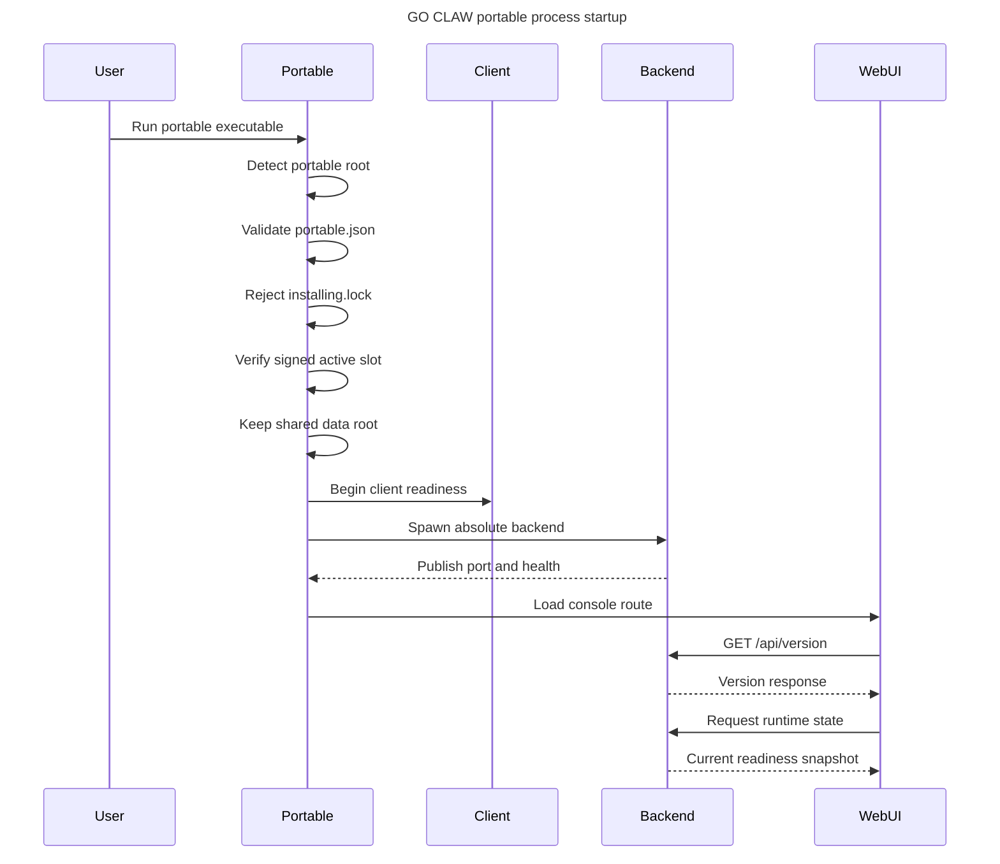
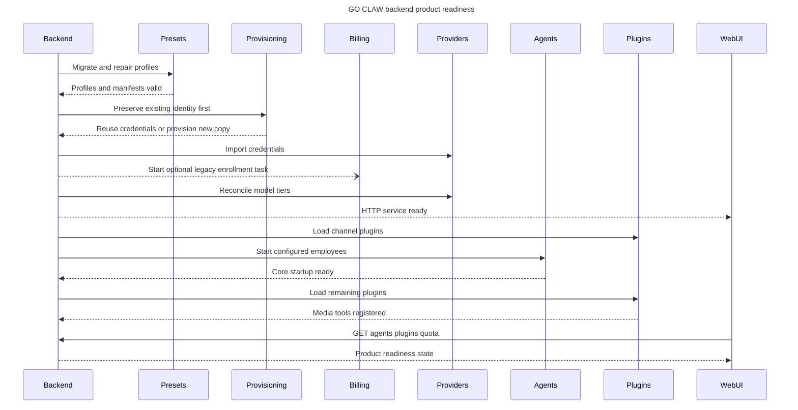
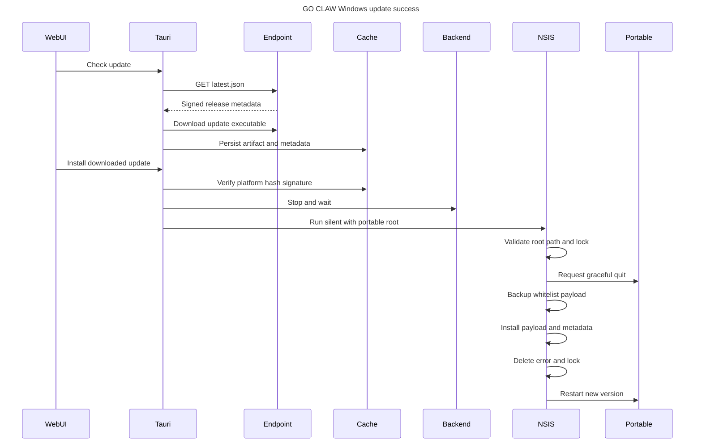
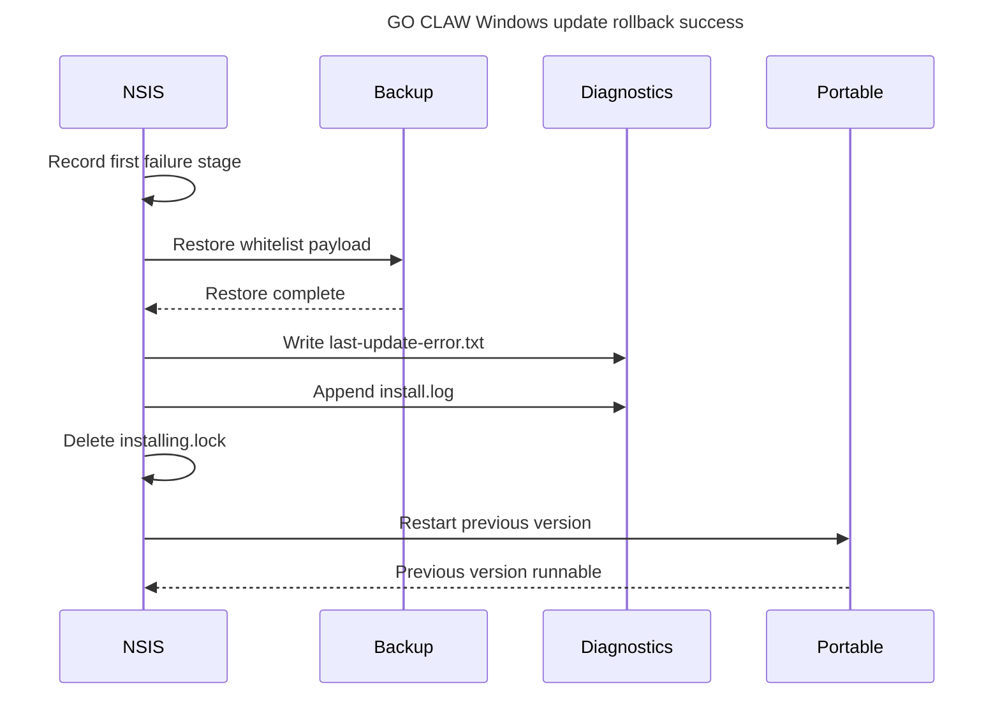
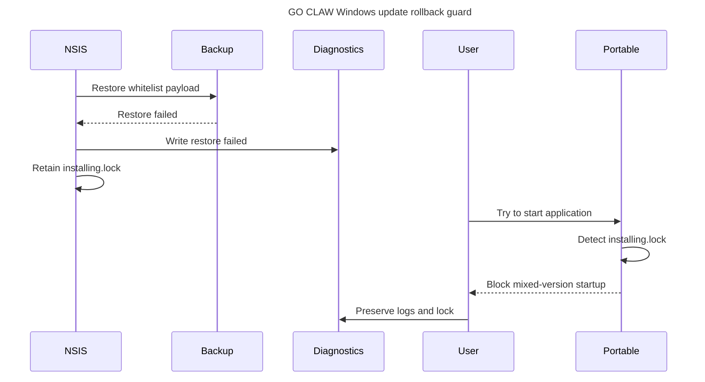
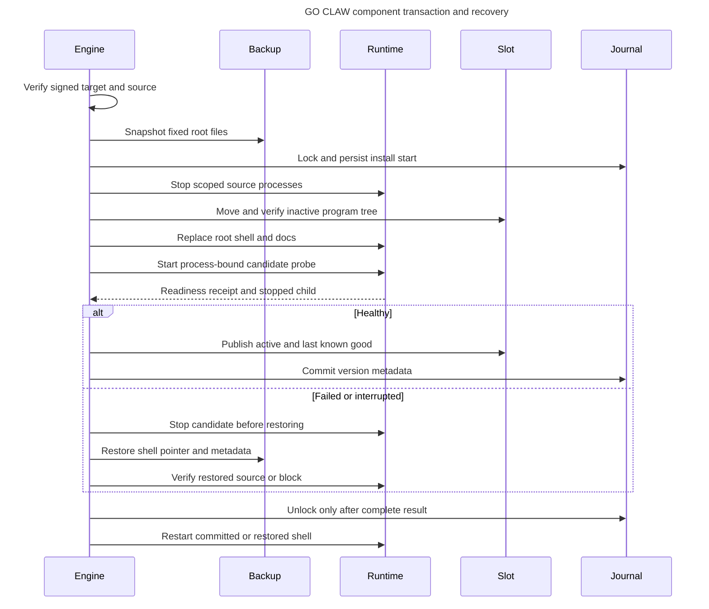

# GO CLAW 运行时序与维护规则

<!-- go-claw-contract:runtime-sequences:v1 -->

> 状态：规范性文档。本文固定当前代码的启动、产品就绪和 Windows 便携更新顺序；代码顺序
> 发生有意变化时，必须在同一提交中同步本文、可执行合同和测试。

## 1. 项目边界与事实来源

GO CLAW 的唯一可写 GitHub 仓库是 `GresonKwan/GO-Claw-2.0`。QwenPaw 是代码来源和当前
Python 包命名空间，不是 GO CLAW 改动的 PR、Issue、Release 或分支目标。`upstream/` 只可
用于只读对照；不得向 `agentscope-ai/QwenPaw` 或其他 QwenPaw 上游仓库写入任何内容。

维护时按以下优先级取事实：

1. 当前代码和本次现场证据；
2. `GO-CLAW-项目事实与发布基线.zh.md`；
3. 本文的规范时序；
4. 对应事故交接和专题运维文档；
5. 计划、历史聊天和旧包快照。

## 2. Windows 便携进程启动

代码锚点：`console/src-tauri/src/lib.rs::run`、
`console/src-tauri/src/portable.rs::PortableState::prepare`、
`console/src-tauri/src/backend.rs::setup`。



不可变条件：`PortableState::prepare()` 必须早于客户端和后端启动；未完成更新锁存在时不得
运行任何可能读取混合版本的后端。

2026-09-05 开发接线：PortableState 保留独立 root/program_root；无 active-slot 指针继续 legacy，
有指针必须验证固定公钥签名、清单摘要和版本，解析失败不退回旧 binaries。prepare 再次确认槽位
未变化，才建立共享目录/环境；后端、Python、Node 从 program_root 定位，data/secrets/backups
仍在产品根。安装锁错误仍优先阻断，尚不允许普通启动绕过锁。Bridge/协调器代码现已接线；这不代表
真实签名大包和完整设备矩阵已经验收。

## 3. 后端启动与产品可用

代码锚点：`src/qwenpaw/app/_app.py::lifespan`、
`src/qwenpaw/app/go_claw_presets.py::ensure_go_claw_presets`、
`src/qwenpaw/app/go_claw_provision.py::provision_go_claw_credentials`、
`src/qwenpaw/app/go_claw_billing.py::ensure_billing_enrollment`、
`src/qwenpaw/plugins/loader.py::PluginLoader.load_all_plugins`。



“HTTP service ready”只表示 API 可以接收请求，不表示产品完整可用。交付和修复验收必须同时
满足：

- `/api/version` 返回预期版本；
- 五个预置员工处于预期运行状态；
- `qwen-image-tool`、`wan27-tool` 均 `loaded=true`、`enabled=true`；
- 内容生产员工暴露五个媒体工具；
- `/api/console/quota` 返回 200 且额度字段有效。

Provisioning 失败按代码约定不阻断进程启动，并在下次启动重试；因此“程序打开了”不能作为
额度和模型已经可用的证据。

身份保留顺序固定为：已有导入 marker/交付凭据直接复用；需要 provisioning 时先读取既有
`instance.id`，损坏/空白/链接原件必须保留并返回 `INSTANCE_ID_RECOVERY_REQUIRED`，不得静默
生成新身份。身份缺失但已有 billing profile、legacy provider secrets、升级结果或槽位指针时，
同样拒绝创建新账号。仅完全没有这些旧身份证据的新盘可以首次创建 ID。证据检查为固定路径，
不递归扫描聊天、不增加远端审计。正常首启失败后重试继续使用已创建的 ID。

Billing enrollment 只能在既有 credentials 导入后异步启动。它必须复用
`data/instance.id` 和现有 NewAPI 子 token 完成 challenge/proof，且只允许原子写入
`data/.go-claw-billing.json`；不得新建或覆盖 NewAPI 用户、token、quota、员工配置或聊天数据。
enrollment、Billing Service 或微信支付不可用时，充值页显示初始化/维护状态，其他产品就绪条件
保持不变。浏览器只访问本机 `/api/console/recharge/*`，billing access token 永远由本机后端代持。
已有合法 billing profile 直接复用；损坏的 profile 保留原件并暂停 enrollment，不能覆盖原账户
归属。身份无法证明时只是充值待恢复，不重置可用聊天、模型凭据或已有额度。

## 4. Windows 在线更新成功事务

代码锚点：`console/src-tauri/src/updates.rs::run_cached_install`、
`console/src-tauri/src/updates/signature.rs::verify_cached_update`、
`console/src-tauri/nsis/go-claw-update.nsi`。



NSIS 必须先把自身工作目录切到 `updates`，再关闭进程和备份 `binaries`。替换白名单只有
`GO-CLAW-Portable.exe`、`binaries`、`LICENSE`、`README-PORTABLE.zh-CN.txt`；客户数据、
凭据、配置和更新现场不在替换范围内。

## 5. 更新失败且完整回滚



只有 `restore=ok` 才能删除更新锁并重启旧版本。诊断至少保留目标版本、首个失败 stage、重试
次数和 restore 结果，不记录凭据。

## 6. 更新失败且回滚不完整



此路径不得自动清锁、继续覆盖或让客户反复重试。先采集 `updates/install.log`、
`updates/last-update-error.txt`、`updates/installing.lock`、版本文件、进程列表和白名单文件状态，
再按首个失败 stage 做单点修复。

## 6A. 组件事务与恢复（v2.1.2 开发代码）

2026-09-05 后端接线顺序：启动时有界恢复交易/状态快照；`status` 和 SSE 只消费进程缓存。
检查由独立引擎验签小目录；下载冻结版本/摘要并启动 staging，不自动安装。安装请求在本机认证及
Host/Origin 通过后，先串行刷新 journal、核对目标与 STAGED，再启动独立引擎；重复请求不重复启动。
引擎从当前程序资源复制到 `updates/engine/<sha256>`，验证复制摘要后运行，不占用要切换的槽位。
点击按钮不清橙点，以引擎持久化 `installationStarted` 为准。SSE 每 15s 心跳；工作时观察 journal，
空闲/等待安装降频，未改变状态不写盘。普通退出取消观察，不终止独立安装引擎；健康探测后端不另起
更新检查。重启只在 OS guard 可独占时由 Rust 将遗留下载标为 INTERRUPTED；不凭 PID 清安装锁。
历史目录只接受有界且已签名的 release catalog；不能降级到仅信任客户端 HTTPS URL 的旧安装路径。

代码锚点：`update_engine/bootstrap.rs`、`recovery.rs`、`native.rs`、
`src/qwenpaw/app/routers/update_readiness.py`。Bridge/产品按钮与 draft 发布构建已接线；legacy 客户端
经 Bridge 进入同一独立引擎。完整签名构建和设备验收未完成前，生产仍使用既有时序。



legacy 来源尚无 lastKnownGood，因此在候选进程完成健康检查并退出之前，**活动指针保持旧值或不存在**；
候选由持锁引擎从指定槽位直接启动，普通壳仍受安装锁阻断。健康后才发布 active/lastKnownGood，避免
提前把未经验证的首个 A 槽写成已知可用。中途失电统一完整恢复旧壳、原指针和版本 metadata。

备份只含根 exe、两份文档、active-slot、version.txt、last-update.json；不复制或恢复 data/secrets/
聊天/账本。替换旧的非活动槽时移入本交易的证据目录，不递归删除。备份先全部验证，再逐项原子恢复；
失败保留锁并记 BLOCKED。恢复固定根文件后，受控启动来源程序再解锁：已有 A/B 来源使用绑定回执；
legacy 来源没有新回执，使用受控进程映像/监听 PID 和公开版本 API，并确认探测进程退出。
这不替代实机测试中按旧 API 读取聊天/附件和额度。OS 独占 guard 才是恢复所有权依据，不能因锁中
PID 不存在而自行清锁。

Windows probe 先校验进程映像和 TCP 监听 PID，再发送随机挑战；回执绑定交易、generation、清单摘要、
PID、版本及员工/插件/实际媒体工具/额度。候选加入 kill-on-close Job；只对引擎自己的探测子进程兜底退出，
用户原进程仅请求正常退出，超时阻断。充值只报告本地 profile configured/not_enrolled/unavailable，
不是服务器可用证明，也不增加核心健康路径的远端开户、审计或充值请求。

## 7. 调试与热修复规则

1. 使用未被失败污染的同版本样本复现；失败样本只用于取证和验证恢复。
2. 先记录阶段，再定位该阶段唯一负责的代码；一次只改变一个变量。
3. 热修复脚本必须支持显式 `ProductRoot`、从脚本目录解析资源、重复运行不破坏状态，并为启动、
   API 等待和验证设置有限超时。
4. 优先启动 GO CLAW 后通过本机 API 获取员工和插件身份并执行修复。不要默认直接解析客户
   `data/config.json`；历史现场已出现 UTF-16LE、BOM 和损坏 JSON。
5. 必须直接修改文件时，顺序固定为：识别编码和 schema、创建时间戳备份、写临时文件、原子
   替换、重新读取验证、启动并执行 API 验收。
6. 管理员权限只解决文件权限，不解决错误路径、编码、schema、进程锁或无限等待。
7. 生产更新源、公开 Release、服务器配置和客户凭据默认只读。诊断授权不等于发布授权。

## 8. 变更与发布门禁

- 修改上述顺序时，同一变更必须更新本文和
  `scripts/verify/go_claw_maintenance_contract.py`，并补充相应单元/合同测试。
- 算力充值默认由 `GO_CLAW_RECHARGE_ENABLED=false` 关闭；关闭建单不得停止 challenge、已付款
  入账、额度 outbox、退款和对账恢复。生产 PostgreSQL/微信配置不完整时必须 fail closed。
- Full ZIP、在线更新包和热修复包是三个独立交付物，不能用其中一个的成功替代另一个验收。
- Full ZIP 必须 provisioning-only；静态 `credentials.json`、签名私钥和构建预检 key 不得入包。
- 正式 Windows 构建必须验证员工、媒体工具、三档模型、媒体插件和实例额度合同。
- 在线更新发布必须从干净旧版本样本开始，在本地 NTFS 与目标 U 盘分别完成下载、验签、替换、
  自动重启、版本一致性和数据保留验收。
- 生产发布前运行：

```powershell
python scripts/verify/go_claw_maintenance_contract.py --repo-root .
```

## 9. 证据与日志索引

| 证据 | 位置或接口 | 用途 |
| --- | --- | --- |
| 后端日志 | `logs/qwenpaw.log` | provisioning、员工和插件启动阶段 |
| 当前版本 | `/api/version` | 进程实际版本，不以 UI 文案代替 |
| 员工状态 | `/api/agents` | 预置员工运行状态 |
| 插件状态 | `/api/plugins` | 媒体插件 loaded/enabled |
| 额度状态 | `/api/console/quota` | 实例识别和额度合同 |
| 更新流水 | `updates/install.log` | NSIS stage 与重试 |
| 更新失败摘要 | `updates/last-update-error.txt` | 首个失败 stage 与 restore 结果 |
| 更新互斥锁 | `updates/installing.lock` | 正在更新或回滚不完整 |
| 更新版本 | `updates/version.txt`、`updates/last-update.json` | 替换结果与前后版本 |
