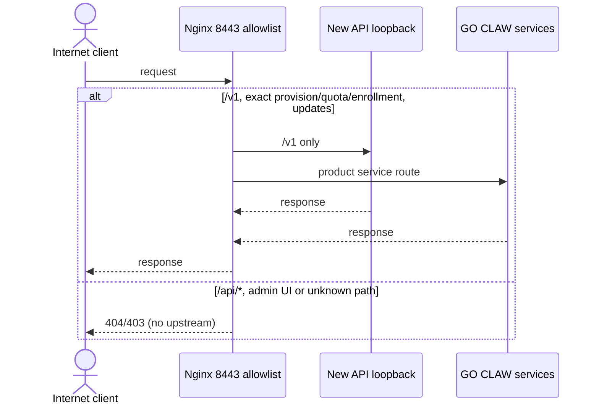

# 2026-09-08 New API 非法注册攻击只读调查

> 状态：已完成生产现场只读调查；尚未实施本文规划的代码、网关或数据修复。
> 时间基准：2026-09-08 16:17（Asia/Shanghai）。
> 调查边界：只读取生产容器、Nginx 配置/日志及 SQLite 摘要；没有修改生产更新源、服务、配置、数据库或账户。

## 1. 结论

生产公网已经遭到针对 New API 注册和登录接口的自动化探测：现存 Nginx 日志中有 46 次注册请求、1126 次登录请求，来源分散。当前应用层注册开关已关闭，且 2026-09-08 新增了注册接口的 Nginx 精确拒绝；但公网 8443 仍以通配 `location /` 代理整个 New API 控制面，这是必须收口的首个边界缺口。

当前数据库没有发现仍存活的“绕过 GO CLAW provisioning 直接注册”普通账户：32 个普通 New API 用户均可映射到 32 条已完成 provisioning 记录，另有 1 个管理员账户。该结论只说明调查时点的存量映射完整，不能反推历史 200 响应都曾注册成功，也不能证明攻击已经停止。

另有一个独立的结构性风险：产品盘 `provision.json` 使用所有设备共享的 HMAC secret，服务器只以实例 ID、时间戳、共享 HMAC 和单 IP 每日上限控制新开户。共享 secret 一旦从任意交付盘提取，攻击者可轮换 IP 批量申请账户。2026-09-08 用户明确将本版本修复范围收敛为 8443 公网权限，不实施一盘一激活凭证、全局开户/pending 熔断或制盘个性化；该风险保留为已知接受项，不能写成已解决。

## 2. 生产事实快照

| 项目 | 只读结果 |
| --- | --- |
| New API | 容器运行中；镜像 `calciumion/new-api:latest`，应用报告 `v1.0.0-rc.24`；宿主仅绑定 `127.0.0.1:3000` |
| Provisioning | systemd 服务运行中，绑定 `127.0.0.1:9100` |
| Billing | systemd 服务运行中，绑定 `127.0.0.1:9200` |
| 公网入口 | Nginx 8443 |
| 应用注册配置 | `RegisterEnabled=false`、`PasswordRegisterEnabled=false` |
| 人机验证/邮箱验证 | Turnstile、邮箱验证均未启用 |
| 注册边界 | `location = /api/user/register { return 403; }`，配置修改时间为 2026-09-08 14:33:18 +08:00 |
| 仍开放的边界 | `location /` 继续代理 `127.0.0.1:3000`，New API 其他 `/api/*` 和管理 UI 仍暴露公网 |
| Billing include | 同一 billing snippet 同时被 443 和 8443 server include；标准客户 billing base URL 使用 443，而 enrollment 由 8443 provision URL 派生 |

没有在文档中保存管理员令牌、HMAC secret、支付密钥、客户凭据、完整 IP 或完整用户名。

## 3. 日志与数据库证据

### 3.1 Nginx 请求聚合

统计范围为服务器现存的 11 个 access log 文件：

| 请求 | 状态聚合 | 来源/时间特征 | 能证明什么 |
| --- | --- | --- | --- |
| `POST /api/user/register` | HTTP 200 × 44；HTTP 403 × 2 | 7 个不同来源；8 月 29 日 7 次、8 月 31 日 1 次、9 月 4 日 1 次、9 月 7 日 25 次、9 月 8 日 10 次，之后出现 403 | 确认注册端点遭自动化请求；不能仅凭 HTTP 200 断言账户创建成功 |
| `POST /api/user/login` | HTTP 200 × 684、400 × 10、404 × 6、429 × 426 | 43 个不同来源 | 确认大量登录探测并触发部分限流；HTTP 200 仍可能携带应用层 `success:false` |
| `POST /go-claw/provision` | HTTP 200 × 13 | 11 个不同来源 | 确认公网 provisioning 被不同来源调用；须结合账本映射判断，不可仅凭来源数定性为恶意 |

New API 的错误经常以 HTTP 200 加 JSON 业务错误返回。因此本调查不把 transport status 当作开户成功证据。

### 3.2 当前账户和 provisioning 映射

| 项目 | 结果 |
| --- | --- |
| New API 用户总数 | 33 |
| 已删除用户 | 0 |
| 普通 `gc-` 用户 | 32 |
| 管理员 | 1 |
| 已产生使用量的账户 | 29 |
| provisioning 总记录 | 34 |
| `done` | 32 |
| `pending` | 2 |
| `done` 映射到的不同 New API user ID | 32 |
| 活跃但未映射的普通用户 | 0 |

4 个已映射普通账户尚无使用量，创建时间位于 8 月 25 日至 9 月 1 日。仅凭“未使用”不足以认定恶意，禁止自动删除。

## 4. 首个失效控制与威胁模型

### 4.1 直接自注册/登录攻击

首个失效控制不是 New API 容器监听地址：容器已经只绑定 loopback。缺口位于 Nginx 公网边界使用通配代理，使本应仅供运维的 New API UI 和 `/api/*` 控制面可从公网访问。应用内“允许注册”开关是可变业务配置，不能代替网关的 fail-closed 路由。

### 4.2 GO CLAW 自动开户滥用

当前客户端使用共享 HMAC secret 对 `{instance_id}:{timestamp}` 签名。它能拦截不知道 secret 的随机请求，但无法区分两块真实产品盘，也无法在一份产品泄露后撤销单个交付单元。当前持久化的“每 IP 每日 5 个新实例”只能减速，不能抵御代理池或分布式来源。

两种攻击面必须分开处理：关闭 New API 公网注册不能解决 provisioning 凭据复制；增加 provisioning 限流也不能证明 New API 管理控制面适合公网开放。

## 5. v2.1.3 规划修复

### 5.1 网关最小公开面

在 GO CLAW 仓库维护可审核的 Nginx 模板，生产 8443 只允许以下产品路由：

- `/v1`、`/v1/`：New API 模型调用；
- `/go-claw/provision`、`/go-claw/quota`；
- `/go-claw/provision/billing/challenges`、`/go-claw/provision/billing/enrollments`；
- `/updates/`、`/updates-staging/`。

显式拒绝 `/api/`，其余 `/` 默认 404。不要在 8443 继续 include 同时带出 customer billing/webhook 的宽泛 snippet；客户充值和微信支付回调维持现有 443 合同，只有 provisioning enrollment 的两个 exact 路径留在 8443。New API 管理 UI 只通过 SSH 隧道访问 `127.0.0.1:3000`。切换前先从现存日志汇总合法客户端是否使用了列表外路径，不凭猜测直接上线。

不以“打开 Turnstile”作为本轮单点修复：v1.0.0-rc.24 的 Turnstile middleware 同时覆盖登录，当前 provisioning 创建子账户后还会调用 `/api/user/login` 取得会话，直接启用会破坏正常开户。后续若移除该登录步骤或设计仅内网 bypass，再独立评估 Turnstile。

### 5.2 明确不实施的扩展方案

本版本不新增 activation voucher、SQLite voucher 状态机、全局每日开户/pending 熔断、客户端请求字段、产品盘文件或制盘工具。现有共享 HMAC、per-IP 限流和 provisioning 数据模型保持不变。若未来重新评估这些能力，必须另行立项，不能从本次事故文档推断已有授权。

### 5.3 账户处置边界

本次只读映射结果作为事故证据保留，但 v2.1.3 不新增周期审计脚本。任何账户处置仍必须另行授权并先备份数据库，再结合 mapping、usage、订单/账本和人工证据判断；8443 权限变更本身不修改账户。

## 6. 固定执行时序

### 6.1 公网请求边界

## 7. 仍需实施后验证的未知项

- 两条 `pending` provisioning 的具体生命周期和是否需要同实例恢复；
- 历史被删除账户无法由当前 `deleted_at=0` 快照证明，需要备份/审计日志才能追溯；
- 当前 New API 镜像使用浮动 `latest` 标签。镜像固定和升级评估应单列运维任务，不与本次公网边界最小修复混为一项。

### 7.1 2026-09-09 上线前公网路径复核

上线前只读汇总当前及 9 月轮转 access log：产品代码、发布基线和已签发凭据都把客户模型基础地址固定为
`https://goclaw.host:8443/v1`。日志中另有 280 次 `/v1beta/models/*:generateContent` 请求，但抽样均为
HTTP 401、无已登记产品合同依据，不能仅凭“出现过请求”扩大公网面；同批还包含 `/openai.json`、
`/anthropic.json`、`.env` 等明显枚举路径。因此本次仍只放行 `/v1`，`/v1beta/*` 由默认 404 拒绝。
若未来产品确需 Gemini 原生协议，必须先新增明确客户端合同、带有效产品身份的 staging smoke 和独立路由测试，
不能通过恢复根路径通配代理实现。

### 7.2 2026-09-09 修复结果

生产切换前以独立 `127.0.0.1:18443` Nginx 实例验证 12 条 allow/deny 路径；随后在当前配置
SHA-256 仍为 `cc999c01bdd8e993f5a3a21c39a6631c83a108d9e4e54b5f979353fa522ead94` 时备份并原子切换。
新配置 SHA-256 为 `7176a90c54148753b952956b37d41825595a8526d9a2de779df16418beef27d5`，两次
`nginx -t` 和 reload 成功。公网管理首页及 `/api/status` 从 200 变为 404；模型、provision、quota、
enrollment 和 updates 保持原后端状态；443 billing 入口不变；更新清单前后摘要一致。SSH 隧道建立时
后台首页和 `/api/status` 为 200，关闭隧道进程后本地端口不可达。

回滚文件：`/root/go-claw-nginx-backups/newapi-8443.conf.before-allowlist-20260909-133903`。
本次未重启业务服务，未读写账户、provisioning/billing 数据库、产品盘或发布资产。

## 8. 上游实现依据

- New API `v1.0.0-rc.24` 路由：<https://github.com/QuantumNous/new-api/blob/v1.0.0-rc.24/router/api-router.go>；
- 注册控制器：<https://github.com/QuantumNous/new-api/blob/v1.0.0-rc.24/controller/user.go>；
- IP 限流 middleware：<https://github.com/QuantumNous/new-api/blob/v1.0.0-rc.24/middleware/rate-limit.go>；
- Turnstile middleware：<https://github.com/QuantumNous/new-api/blob/v1.0.0-rc.24/middleware/turnstile-check.go>。

这些链接用于确认当前 tag 的路由与 middleware 行为；GO CLAW 不向 New API/QwenPaw 上游提交本次产品修复。
