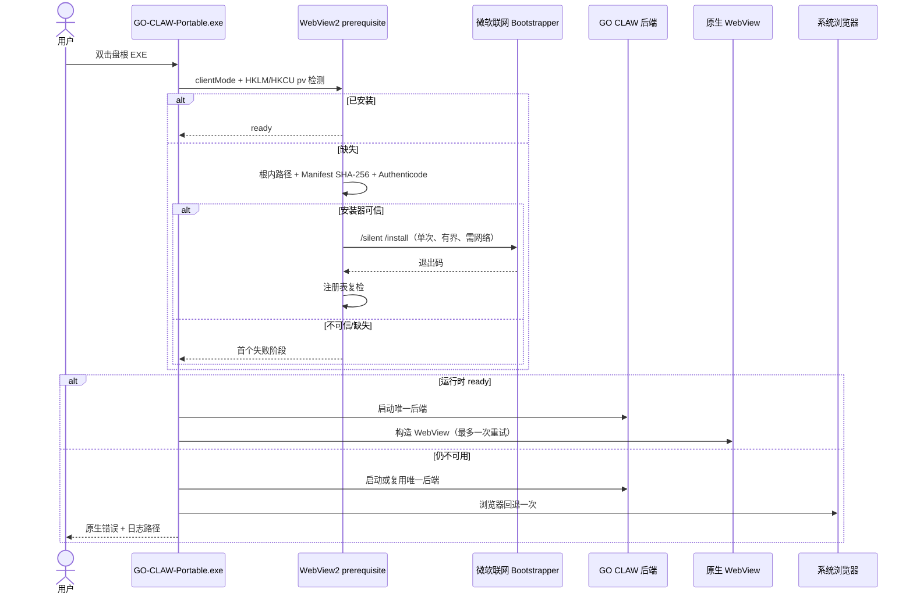
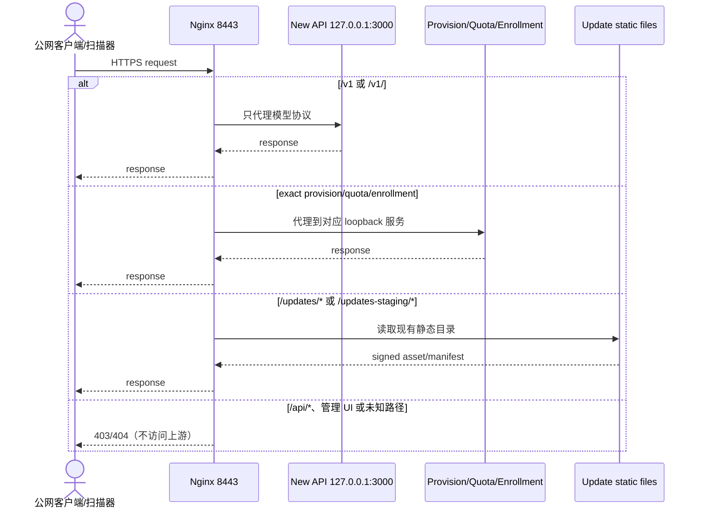
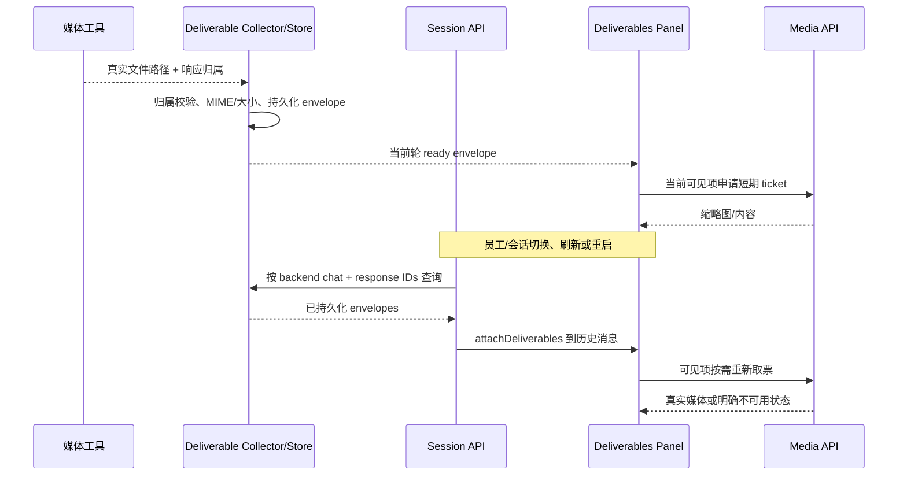
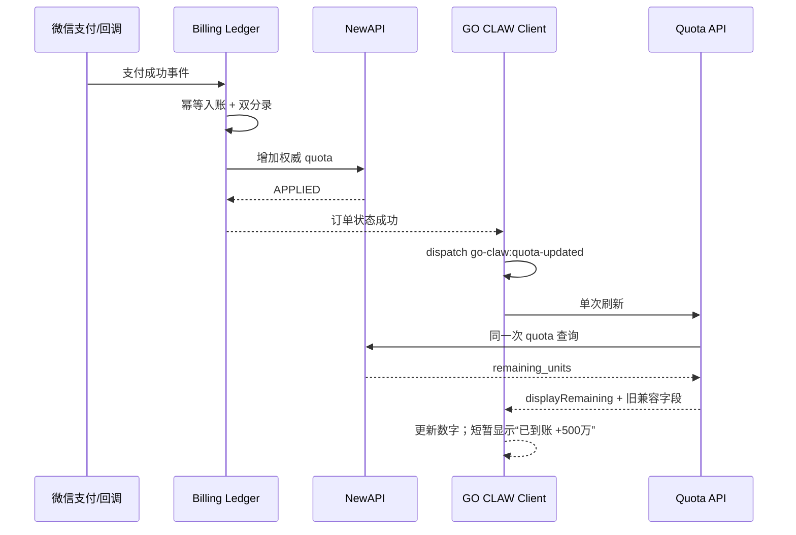

# GO CLAW v2.1.3 详细实施计划

> 状态：Phase S1 与 Phase 1–6 核心代码、本地完整 Main Build、逐文件完整性检查和 Portable 中文目录/换盘符验收已完成。签名 CI、缺少 WebView2 的干净机、真实媒体、Release 和生产更新切换尚未完成，不得写成已发布。
> 日期：2026-09-08（Asia/Shanghai）。
> 上位约束：`AGENTS.md`、`docs/GO-CLAW-项目事实与发布基线.zh.md`、`docs/GO-CLAW-运行时序与维护规则.zh.md`、`docs/GO-CLAW-Windows产品U盘交付标准.zh.md`。
> 范围来源：`docs/superpowers/plans/2026-09-07-go-claw-v2.1.3-todo.zh.md`。

## 0. 文档结论与实施边界

v2.1.3 收敛四项工作，并按相互独立的故障域实施：

1. **P0 / WebView2 开箱启动**：标准 Windows x64 产品盘携带微软官方 x64 Evergreen Bootstrapper。系统缺少 WebView2 且机器联网时，用户仍只需双击盘根 `GO-CLAW-Portable.exe`，应用有界联网安装、复检并打开原生客户端；无网络或安装失败时只回退一次浏览器。
2. **DEBUG-01 / 交付产物预览与历史恢复**：先在未经热修复的正式 v2.1.2 样本上记录首个失败 stage，再做单点最小修复。图片缩略图、当前页预览、会话切换、刷新和重启后的历史恢复都必须成立。
3. **UX-01 / 算力余额优先**：侧边栏以剩余算力数字为主，不再用历史累计剩余率作为主信息；到账后即时显示权威余额和一次非阻塞到账反馈。计费、账本和换算合同不变。
4. **SEC-01 / New API 8443 公网权限收口**：公网只开放 GO CLAW 必要路由，New API 管理界面改为 SSH 隧道访问；不改变账户、provisioning、客户端或产品盘。

以下不属于 v2.1.3：

- 不重写 v2.1.2 A/B 组件更新引擎，不改签名算法、不改支付下单/退款/对账流程；
- 不改变 NewAPI 媒体渠道主备拓扑、模型价格、频控或员工模板；不修改 New API 上游源码或浮动镜像；
- 不向 QwenPaw 源项目提交任何 PR、commit、Release 或配置；唯一可写仓库仍为 GO CLAW；
- 不以修复名义清空、迁移或重建客户 `data/`、`secrets/`、聊天、员工、额度账户或充值账本；
- 不根据注册日志、IP 或“尚未使用”单一信号自动删除/封禁 New API 用户；账户处置必须另有备份、映射、使用量和账务证据；
- 不新增 activation voucher、SQLite voucher 表、全局开户/pending 熔断或产品盘个性化流程；共享 HMAC 的既有限制作为已知风险保留；
- 不在 v2.1.3 代码完成前修改生产更新软链或生产 manifest。

### 0.1 2026-09-09 本地实施进度

- `DEBUG-01`：LRU 会话缓存命中时补做轻量交付物索引恢复；仅在索引成功后置完成标志，瞬态失败下次切回重试。缩略图和当前页预览遇票据失效时各只续签一次，仍失败则保留卡片并显示明确不可用状态；
- `UX-01`：provisioning 以整数公式只增 `displayRemaining`，router 和前端均按可选安全整数透传；侧边栏改为余额优先、500 万绝对低余额阈值、折叠状态点及到账约 3 秒反馈，旧三字段服务端继续显示兼容百分比；
- `WV2-01`：启动前检查 HKLM/HKCU，验证产品根、Manifest、SHA-256、WinTrust、Microsoft 公司信息及微软内部 `OriginalFilename=MicrosoftEdgeUpdateSetup.exe`，单次 `/silent /install`、300 秒有界等待、复检，失败只触发一次浏览器回退；
- 构建/更新：portable 自带 `WebView2/MicrosoftEdgeWebview2Setup.exe`、根 Manifest/SHA256SUMS；A/B 新增 `bootstrap-root`，旧盘缺少这些根文件时按“原本不存在”快照并可完整回滚；release schema、Full ZIP 和 CI 校验同步；
- 本地验证已经通过：前端 169 文件/1261 项，Rust 67 + 22 + 38 项，关键 Python/包装合同 254 项；完整 Python 集为 5853 passed、62 skipped、11 个未触及的既有 Windows 路径/编码/权限失败。最终代码对应的本地 Main Build 成功，Portable ZIP 为 637,870,229 字节、SHA-256 `3324d5b782d4d2dfc430c20b96767f11a22b47eef226a8d7731869968d0d6e52`；13,265 个 Manifest 载荷和 13,266 条校验和逐项通过。中文路径、P→R 换盘符、单实例、优雅退出、workspace 重绑定及外部项目路径保留均通过。签名 CI、缺少 WebView2 的干净机和真实媒体证据仍须单独追加。

## 1. 当前事实与基线门禁

### 1.1 当前工作副本边界

截至 2026-09-09 H 盘链路再次不稳定后的恢复工作区：

- H 盘不作为本轮构建依赖，原 H 盘工作树保持不变；
- 当前唯一实施工作树为独立恢复仓库 `D:\GO-CLAW-v212-build-work\v213-recovered-20260909`；
- 当前分支为 `codex/v2.1.3`，起点 HEAD 为 `fc92d9709fc8e78ddeb767631f68d00da6276039`；
- `origin` 已核对为 `https://github.com/GresonKwan/GO-Claw-2.0.git`，不是 QwenPaw 上游；
- 工作树包含本轮/前序尚未提交的文档修改，实施时必须保留并先审阅 diff，不能用 clean/reset 操作丢弃。

### 1.2 开始程序修改前的基线门禁

1. 只读核对 `git remote -v`、目标分支、v2.1.2 tag/Release 对应 commit、v2.1.2 发布后已批准的小修；
2. 审阅当前 dirty/untracked 文档，区分用户已有修改与本轮设计；不覆盖、不丢弃；
3. 从核实后的 v2.1.2 发布基线加已批准后续修复创建或整理 `codex/v2.1.3`；不得仅凭目录名或版本字符串选起点；
4. 运行 `git diff --check`，记录绝对路径、HEAD、origin 和工作树状态到当天 preflight；
5. 安全服务端工作先使用只读调查结果和独立备份；未经明确授权不得直接修改生产 Nginx、systemd、数据库或账户。

如果 Git 事实再次不可读，允许继续只读取证，但不得构建正式候选、签名、发 Release 或切生产。

## 2. 不变量与兼容合同

### 2.1 老用户数据不变量

v2.1.2 → v2.1.3 更新前后，下列路径和语义保持不变：

- `data/`：聊天、会话索引、员工 workspace、交付产物索引和业务数据；
- `secrets/`：实例身份、provider/开通凭据及本地计费 profile；
- `logs/`、`cache/`、`backups/`、`updates/`：仍位于 portable 产品根；
- `portable.json`、`GO-CLAW-Config/` 及现有 instance/account 绑定；
- NewAPI 用户、令牌、剩余额度、累计净消耗、充值订单、双分录账本和退款状态。

组件安装只写其清单声明的程序文件及非活动槽。任何清单不得拥有 `data/`、`secrets/`、账本或客户 workspace。

### 2.2 滚动兼容

- v2.1.3 客户端遇到仍未升级、只返回 `granted/remaining/percent` 的额度服务端时，继续显示上一次成功值或旧百分比兼容态，不允许额度区域空白或崩溃；
- 新服务端新增字段必须是可选、只增不删，v2.1.2 客户端忽略后仍可工作；
- v2.1.2 已有 deliverables 持久记录不迁移、不重写。v2.1.3 必须按已有 envelope/response ID 合同回读；
- 没有 WebView2 的旧用户通过在线更新获得 v2.1.3 时，组件包必须同时带入可信联网 Bootstrapper 和对应 manifest，不能只在 Full ZIP 中存在；
- 8443 权限变更只发生在 Nginx 路由层，原有 `provision.json`、instance、New API 用户、令牌和额度合同完全不变。

### 2.3 性能边界

- 额度区继续复用现有 60 秒刷新、窗口 focus 和 `go-claw:quota-updated` 事件，不增加轮询；
- 历史交付物只按当前会话最近受控轮次查询，媒体票据按需获取；不把图片/video base64 写进聊天，不递归扫描产品盘，不首屏预取全部媒体；
- WebView2 检测只读两个固定注册表位置。运行时已安装时不得启动安装器、不得访问网络；
- 8443 allowlist 不增加代理跳数或应用请求；拒绝路径在 Nginx 直接返回，不访问 New API upstream；
- 新增日志均为阶段、结果、退出码和脱敏路径，不记录密钥、支付凭据、客户消息正文或完整媒体内容。

## 3. 目标合同

### 3.1 WebView2 启动合同 `WV2-01`

| 条件 | 必须行为 | 禁止行为 |
| --- | --- | --- |
| `clientMode=browser` | 沿用显式浏览器模式 | 检测或安装 WebView2 |
| `clientMode=auto` 且注册表版本有效 | 直接构造 WebView | 启动安装器或网络下载 |
| 运行时缺失、安装器可信 | `/silent /install` 单次执行；有界等待；注册表复检；WebView 单次重试 | 循环安装、强制管理员、依赖固定盘符/CWD |
| 安装器缺失/越界/哈希错/签名错 | 拒绝执行；记录首错；浏览器回退一次 | 执行未知 EXE、修改客户数据 |
| 安装失败/超时/复检失败 | 原生错误提示含日志位置；浏览器回退一次 | 假死、重复后端、无限等待 |

可信安装器必须同时满足：

1. 解析后的普通文件位于当前 portable 根 `WebView2/` 内，不能经符号链接/reparse point 逃逸；
2. SHA-256 等于产品根 `MANIFEST.json` 对应记录；
3. Windows Authenticode 链有效，签名发布者为 Microsoft Corporation；
4. 构建期已断言它是微软官方 x64 Evergreen Bootstrapper，并在 manifest 准确声明 `evergreen-bootstrapper`、`requiresNetwork=true`。

### 3.2 New API 公网边界合同 `SEC-213`

Nginx 8443 采用 allowlist，不再把 New API 控制面整体代理到公网：

| 公网路径 | 上游 | 结果 |
| --- | --- | --- |
| `/v1`、`/v1/` | `127.0.0.1:3000` | 允许模型协议流量 |
| `/go-claw/provision`、`/go-claw/quota` | provisioning loopback | 允许开户和额度流量 |
| `/go-claw/provision/billing/challenges`、`/go-claw/provision/billing/enrollments` | provisioning loopback | 只允许 billing enrollment 两个 exact 路径 |
| `/updates/`、`/updates-staging/` | 现有静态发布目录 | 保持现有更新合同 |
| `/api/`、New API 管理 UI、其他路径 | 无 | 403/404，禁止进入上游 |

New API 管理 UI 只允许运维通过 SSH 隧道访问 `127.0.0.1:3000`。客户充值 API 与微信支付 callback 继续使用 443 的现有 billing 合同，不在 8443 重复暴露；billing internal/admin 路径仍不得公网访问。切换 allowlist 前必须从现存 access log 汇总合法产品路径，防止遗漏实际合同；不能保留兜底 `location /` proxy。

后台访问操作合同：

```powershell
ssh -N -L 127.0.0.1:13000:127.0.0.1:3000 -i "<SSH私钥路径>" <运维用户>@<服务器>
```

隧道运行期间只打开 `http://127.0.0.1:13000`；本地监听必须显式绑定 `127.0.0.1`，不得使用 `0.0.0.0` 或开启 `GatewayPorts`。关闭 SSH 进程后该网页入口应立即失效。

本合同只修改 Nginx 8443 server block：

- 不改 `scripts/provisioning/provision_server.py`、`src/qwenpaw/app/go_claw_provision.py` 或 New API 数据库；
- 不新增 activation/voucher、开户熔断、客户端字段、产品盘文件或 CI secret；
- 不删除、禁用或重建任何用户；
- 原有新盘开户、老用户 instance 恢复、quota、billing enrollment、充值和更新请求保持同一 URL/响应合同。

### 3.3 交付产物合同 `DL-213`

- 生成成功且文件仍可读时，当前轮必须出现 ready envelope 和真实缩略图；
- 点击小眼睛在当前页面预览图片；视频沿用可播放预览；“打开所在位置”仍走受控后端命令；
- 切换员工、切换会话再返回，刷新页面或重启应用后，同一 response ID 的交付区域必须从持久化状态恢复；
- 文件删除、损坏、MIME 不符、票据过期或接口失败时，保留交付区域并给出单项不可用状态，不因一项失败隐藏整个 panel；
- media ticket 短期有效、绑定用户/员工/会话/轮次/文件。过期只允许按当前项重新取票一次；
- 文件名和路径覆盖空格、中文及非 ASCII，URL 路径段只编码一次。

### 3.4 额度响应合同 `QT-213`

现有额度接口保留三个字段，并新增一个可选字段：

```json
{
  "granted": 8.0,
  "remaining": 3.3,
  "percent": 41,
  "displayRemaining": 220000000
}
```

字段语义：

- `granted`、`remaining`、`percent`：保持 v2.1.2 语义，不改旧客户端；
- `displayRemaining`：非负整数，代表用户侧“剩余算力”，不得是美元、人民币或 NewAPI quota unit；
- 服务端从同一次权威 quota 查询的原始 `remaining_units` 计算：`floor(remaining_units × 200 / 3)`；不得先经浮点美元换算再反推；
- 该式与既有 `￥1 = 500万展示算力`、`1分 = 750 NewAPI quota unit` 完全一致；
- 前端只接受非负安全整数。字段缺失或不合法时走 v2.1.2 兼容显示，不自行猜余额；
- 本版本不新增数据库字段，不改变充值账本，也不把一次充值金额当成余额分母。

建议显示格式：

- `< 1万`：完整整数；
- `1万–1亿`：紧凑“万”，最多一位有意义小数且去掉尾随 `.0`；
- `≥ 1亿`：紧凑“亿”，最多一位有意义小数；
- tooltip/无障碍名称给出完整分组整数，例如“剩余算力 220,000,000”。

## 4. 固定运行时序

### 4.1 缺少 WebView2 的首次启动



### 4.2 New API 公网 allowlist



### 4.3 当前轮与历史交付物



### 4.4 充值到账与侧边栏刷新



## 5. 实施阶段与逐文件修改

### Phase 0：核对 Git 与冻结证据

**目标**：得到可追溯分支和正式 v2.1.2 干净样本；不先猜 DEBUG-01 原因。

执行：

1. 完成 §1.2 的 Git 基线核对，记录 HEAD/origin/status；
2. 只读核对 GitHub v2.1.2 Release 资产、签名和正式 Main Build run；
3. 对生产 `/updates/manifest.json` 只读记录当前版本，不切软链；
4. 从正式 v2.1.2 资产解压到独立测试目录，记录 ZIP/EXE/关键二进制 SHA-256；
5. 复制最小、脱敏的测试身份时，聊天数据只做前后摘要，不写回原产品盘；
6. 建立 `docs/incidents/2026-09-08-v2.1.3-preflight.zh.md`，记录每项事实来源和未知项；
7. 将 New API 只读调查固定在 `docs/incidents/2026-09-08-newapi-registration-attack-investigation.zh.md`，生产变更前不得用后来状态覆盖原始证据。

完成条件：能够给出“哪个 commit/资产/样本”而不是只说“v2.1.2”。

### Phase S1：SEC-01 8443 公网边界

> 实施状态：2026-09-09 已完成。生产配置已备份并原子切换；staging/production smoke、更新摘要不变和 SSH 隧道关闭即失效均通过。未修改数据库、账户、客户端、产品盘或更新源。

该阶段不依赖客户端发布，不修改 provisioning/数据库/产品盘，但生产 Nginx 上线仍需独立授权和回滚窗口。

新增 `deploy/nginx/go-claw-newapi-public.conf`：

- 显式列出 `/v1`、`/v1/`、`/go-claw/provision`、`/go-claw/quota`、两个 `/go-claw/provision/billing/*` exact enrollment 路由和两个 updates 静态前缀；
- `/api/` 使用 `location ^~ /api/ { return 404; }`，保留 exact register 403 作为纵深防御；
- 默认 `location / { return 404; }`，禁止 fallback proxy；
- 只把模型协议转发给 `127.0.0.1:3000`；provision/quota/enrollment 保持 `127.0.0.1:9100` 的现有 rewrite；从 8443 移除会重复暴露 billing customer/webhook 的宽泛 include，443 billing 配置另行 smoke、不随本修复改路由；
- 现有 `/go-claw/healthz` 不属于客户合同，默认不再公网开放；本机监控改查 `127.0.0.1:9100/healthz`。若日志证明有已登记外部监控，迁移监控后再关闭，而不是把 healthz 扩成通配产品前缀；
- 保留现有 body size、Range、超时、TLS 和必要 header 合同，不复制 secret 到模板。

新增测试：

- `tests/unit/scripts/test_newapi_public_surface.py`：解析生成的 Nginx 模板，证明 allowlist 可达且 `/api/*`/未知路径无 upstream；
- 覆盖 `/v1`、exact provision/quota/enrollment、updates、register/login/UI/未知路径、443 billing 不回归；测试不连接生产、不读取用户数据库、不在 CI 中要求 SSH。

上线执行顺序：备份当前 Nginx 文件 → 保存 `nginx -T` 脱敏摘要 → 生成候选配置 → `nginx -t` → 在隔离/staging 端口执行 allow/deny smoke → 原子替换并 reload → 从公网复验合同路径和拒绝路径 → 失败立即恢复配置并 reload。全过程不备份或修改 New API/provision 数据库。

后台访问固定为本机 SSH tunnel，例如 `127.0.0.1:<local-port> -> server 127.0.0.1:3000`；验证关闭 SSH 进程后本地端口立即失效。日常操作后续可换低权限 SSH 用户，但不作为本次 8443 收口的阻塞项。

### Phase 1：DEBUG-01 干净复现与首个失败 stage

**只取证，不改代码。** 按以下顺序，一旦找到首个失败 stage 就停止向后推断：

1. **Stage A 生成**：记录员工、chat/turn/response ID（脱敏）、工具返回；确认图片文件存在、字节可读、大小、SHA-256、MIME；
2. **Stage B 采集/持久化**：核对本轮 envelope、store 文件、response ID 索引和归属；
3. **Stage C 历史恢复**：切员工、切会话、返回、刷新、重启；记录 session history 和 deliverables query 是否发生、response ID 是否一致；
4. **Stage D 媒体读取**：记录 ticket 请求、thumbnail/content HTTP 状态、响应 MIME、过期重取行为；
5. **Stage E 前端呈现**：记录 Panel render 条件、单项状态、浏览器 Console，不把捕获异常静默吞掉。

取证文件至少包括：后端日志、浏览器 Network/Console 导出、对应 envelope JSON 脱敏副本和媒体文件摘要。禁止把客户聊天正文、密钥、支付 token 纳入附件。

### Phase 2：DEBUG-01 单点最小修复

只有 Phase 1 证据命中的层可以修改。预计核查点如下，但不是预设根因：

| 层 | 可能修改文件 | 允许的最小修改 |
| --- | --- | --- |
| 历史会话回填 | `console/src/pages/Chat/sessionApi/index.ts`、`console/src/pages/Chat/deliverables.ts` | 确保 session cache 命中也能取得/合并当前历史 response IDs 的持久化 deliverables；按会话失效，不全局清缓存 |
| 消息渲染 | `console/src/pages/Chat/HostBubbles.tsx`、`console/src/pages/Chat/components/DeliverablesPanel/index.tsx` | panel 由 envelope 状态决定；单项失败不让整个 panel 返回 `null` |
| 媒体票据 | `console/src/pages/Chat/components/DeliverablesPanel/MediaDeliverablesRail.tsx`、`console/src/pages/Chat/components/DeliverablesPanel/ArtifactPreviewDialog.tsx` | 图片和视频统一：票据过期/401/403 后按当前项重取一次；失败显示明确占位，不循环 |
| API/持久化 | `console/src/api/modules/deliverables.ts`、`src/qwenpaw/app/routers/deliverables.py`、`src/qwenpaw/app/deliverables/` | 只修首个失败合同；保持归属鉴权、根目录约束和短期票据 |

定向测试：

- `console/src/pages/Chat/deliverables.test.ts`：缓存命中、历史回填、response ID 关联；
- `console/src/pages/Chat/components/DeliverablesPanel/DeliverablesPanel.test.tsx`：ready/partial/unavailable；
- `console/src/pages/Chat/components/DeliverablesPanel/mediaDeliverables.test.tsx`：图片预览、票据过期单次续取、中文/空格路径；
- `tests/unit/app/routers/test_deliverables_contract.py` 与 `tests/unit/app/deliverables/`：持久化、归属、MIME、missing/corrupt；
- 一次真实图片、一次真实视频或已存在正式 MP4 非回归，不为验证 UI 重复产生高成本媒体。

### Phase 3：额度接口只增字段

#### 3.1 服务端

修改 `scripts/provisioning/provision_server.py`：

1. 从已有同一次 NewAPI quota 查询保留原始 `remaining_units`；
2. 以整数算术计算 `displayRemaining = remaining_units * 200 // 3`；
3. 旧 `granted/remaining/percent` 计算和错误码保持不变；
4. 增加非负、类型和合理上界检查；异常时宁可不返回新字段，也不返回伪造数字；
5. 不查询充值账本，不增加 SQL，不引入新缓存或后台任务。

修改 `src/qwenpaw/app/routers/quota.py`：

- 对上游新字段做可选透传；
- 旧上游没有该字段时仍返回原三字段；
- 不把 provisioning 内部 URL、令牌或 NewAPI 原始单位暴露给前端。

修改/新增测试：

- `scripts/provisioning/test_provision_server.py`：0、￥1 对应 500万、叠加余额、非整除向下取整、充值后百分比不回 100% 但数字增加；
- `tests/unit/app/routers/test_quota_router.py`：新字段、旧响应、非法字段拒绝、上游失败保留原错误语义。

#### 3.2 前端类型与格式化

修改 `console/src/api/modules/quota.ts`：

- `displayRemaining?: number`；运行时校验非负安全整数；
- 保持旧字段必需性与旧响应可解析。

建议新增 `console/src/layouts/quotaDisplay.ts`：

- 纯函数格式化万/亿及完整整数；
- 纯函数选择 `normal/low/unavailable`，不读取 DOM、不发请求；
- 低余额阈值先按视觉确认冻结；当前建议为 `500万`，含义是“已低于一次最低 ￥1 充值所得算力”，不是消费百分比。

### Phase 4：侧边栏额度 UI（视觉确认后编码）

首选方案是“**余额数字 + 状态文字 + 充值入口**”，不显示百分比、不保留进度条：

- 展开态第一行：`算力余额`；右侧品牌橙数字，例如 `5,280万`；
- 第二行：正常为 `余额充足`，低余额为 `算力不足，请充值`；右侧 `充值`；
- 整个余额区域可点击进入现有算力充值页，`充值`仍是清晰的键盘可达动作；
- 到账反馈用位于额度区上方的临时浮层或不占位提示 `已到账 +500万算力`，不得导致底部导航跳动；
- 折叠态只显示算力图标和状态点；focus/hover 提供完整余额，不把数字挤入窄栏；
- API 短暂失败时保留最后一次成功数字并用弱化状态标识，不闪成 0；从未成功且不可用时显示 `--`。

修改：

- `console/src/layouts/QuotaBar.tsx`：改为余额主信息、旧响应兼容、到账反馈、折叠态；复用原事件和刷新时序；
- `console/src/layouts/index.module.less`：固定两行区域高度，浮层绝对定位，不因状态/反馈/tooltip 出现产生布局位移；
- i18n 资源：新增“算力余额、余额充足、算力不足、充值、已到账、暂不可用”的中英文 key，不在 JSX 硬编码；
- `console/src/layouts/QuotaBar.test.tsx`：数值格式、兼容 fallback、到账刷新一次、上次成功值、低余额、折叠 tooltip、键盘入口、无额外 polling。

视觉冻结项：

1. 正常态是否采用推荐的“状态文字”，而不是无百分比细色带；
2. 低余额阈值是否采用绝对 `500万`；
3. 到账反馈采用不占位浮层，显示约 3 秒，并在 `prefers-reduced-motion` 下不做位移动画。

本文附带的视觉稿用于冻结上述三项。用户确认后把确认结果写回本节，不凭开发者个人偏好改变。

### Phase 5：WebView2 runtime、启动器与构建链

#### 5.1 Rust prerequisite 模块

建议新增 `console/src-tauri/src/webview2_runtime.rs`，并在 `console/src-tauri/src/client.rs` 的 `try_build_webview` 之前调用：

- `detect_installed_runtime()`：只读 HKLM/HKCU 固定 Client GUID 的 `pv`，接受严格大于 `0.0.0.0` 的版本；
- `resolve_bootstrapper(portable_state)`：从 `PortableState.root/WebView2/MicrosoftEdgeWebview2Setup.exe` 解析、canonicalize，并拒绝根外、目录、链接/reparse point；
- `verify_installer()`：读取 `MANIFEST.json` 的对应相对路径和 SHA-256；调用 Windows 信任 API 验证 Authenticode 及 Microsoft 发布者；
- `install_once()`：`Command` 参数数组传 `/silent`、`/install`，不经 shell；最长等待 300 秒；记录 started/exit/timeout/postcheck；
- `ensure_runtime()`：只在 `ClientMode::Auto` 执行；同一进程只尝试一次；安装后注册表复检；返回结构化 stage/error；
- 不强行结束仍在执行的微软安装事务。超时、断网或下载失败后本次应用不再重启安装器，记录状态并进入一次浏览器回退。

修改 `console/src-tauri/src/client.rs`：

1. `Browser` 模式保持原行为；
2. `Auto` 模式先 prerequisite，再启动/复用唯一后端并构造 WebView；
3. 安装后 WebView 只重试一次；
4. 失败使用现有原生错误能力显示简短原因和 portable 日志路径，然后浏览器回退一次；
5. 不因 prerequisite 失败启动第二个后端或第二个浏览器页。

修改 `console/src-tauri/src/portable.rs`：只在确有必要时增加 `webview2_installer`/manifest 解析 helper；共享数据根和 `program_root` 语义不变。

修改 `console/src-tauri/Cargo.toml`：只增加注册表、Windows trust/cryptography 所需的最小 Windows API feature；网络下载由微软 Bootstrapper 自己完成，不引入自写下载器或新的常驻服务。

Rust 测试：

- registry：HKLM/HKCU、有值/空值/`0.0.0.0`/坏版本；
- 路径：换盘符、空格/中文、缺失、目录、根外、链接逃逸；
- manifest：命中、缺项、大小写/路径分隔、哈希错；
- state machine：已有 runtime 不安装；成功只重试一次；失败/超时只回退一次；browser 模式零检测；
- Windows 真签名验证单独作为 Windows CI 合同，非 Windows 单测不伪造 WinTrust 成功。

#### 5.2 官方联网 Bootstrapper 与 Portable 结构

调整 `.github/workflows/desktop-build.yml` 的顺序：

1. 从微软官方固定分发入口下载 **x64 Evergreen Bootstrapper**；构建日志固定最终来源和重定向结果；
2. 验证合理的 Bootstrapper 体积范围、PE、产品/文件身份、有效微软 Authenticode 和 SHA-256；不得用 Standalone 的约 127 MB 体积阈值误拒合法的约 1.8 MB 文件；
3. 先将安装器传给 portable staging，再生成 portable ZIP；
4. `Portable/WebView2/MicrosoftEdgeWebview2Setup.exe` 必须进入 portable ZIP；
5. 再从同一 Portable staging 组 Full ZIP，不在 Full ZIP 根另建一份重复 `WebView2`；
6. build summary 记录官方 URL、文件大小、版本、SHA-256 和签名主体，不记录任何 secret。

修改 `scripts/pack-tauri/stage_windows_portable.py`：

- 新增必需 `--webview2-installer`；
- 复制到 staging 的 `WebView2/`；
- 生成适用于“Portable 内容铺平到 U 盘根”的 `MANIFEST.json` 与 `SHA256SUMS.txt`；路径不得带 Full ZIP 的 `Portable/` 前缀；
- portable README 标题/版本来自唯一版本源，不保留旧 `2.0.1` 文案。

修改 `scripts/pack-tauri/build_windows_full_bundle.py`：

- 复用已完整的 Portable staging；
- 移除 Full ZIP sibling `WebView2` 复制逻辑；
- Full ZIP 总 manifest 仍使用 `Portable/...` 路径，产品盘 manifest 则使用铺平后的相对路径，两者不可互相复制冒充。

修改 `scripts/verify/windows_release_contract.py` 及相关测试：

- 必须项改为 `Portable/WebView2/MicrosoftEdgeWebview2Setup.exe`；
- 断言 Bootstrapper 类型、合理体积、微软签名、manifest 中 `evergreen-bootstrapper`/`requiresNetwork=true` 和 SHA-256 一致；
- 解开 `Portable` 后按产品盘根目录合同再验证一次；
- 明确加入反例：把 Bootstrapper 标成 `evergreen-standalone-x64`、声明不联网、来源非微软、签名无效或文件身份不符时必须拒绝。

#### 5.3 组件 A/B 更新携带 prerequisite

核对 `scripts/pack-tauri/build_component_packages.py`、`scripts/pack-tauri/assemble_component_manifest.py`、`scripts/pack-tauri/update_components.py`、update-v2 ownership/schema 和 CI：

- 将 `WebView2/`、产品根 `MANIFEST.json`、`SHA256SUMS.txt` 归入明确的 bootstrap/root 组件；
- 从 v2.1.2 更新到 v2.1.3 时，该组件能安装到产品根且不归入 active slot；
- manifest 的旧客户数据排除规则不变；
- 组件签名、哈希和事务仍走现有 v2.1.2 A/B；不为 WebView2 新建第二套更新器。

### Phase 6：版本、合同与用户文档

只有 Phase S1 与 Phase 1–5 定向测试通过后才把唯一产品版本提升到 `2.1.3`：

- `src/qwenpaw/__version__.py`；
- 由现有 version action/materialize 脚本生成的前端、Tauri、构建元数据；禁止手工制造第二版本源；
- 新增 `docs/contracts/v2.1.3/README.zh-CN.md`，收录 `WV2-01`、`SEC-213`、`DL-213`、`QT-213` 兼容合同；
- 更新 `START-HERE.zh-CN.txt`、portable README、`GO-CLAW-Windows产品U盘交付标准.zh.md`、`GO-CLAW-运行时序与维护规则.zh.md`；
- 更新事实基线和变更台账时严格区分“已编码、CI、实机验收、Release、生产切换”，不得提前写成已发布；
- 发布前复核产品盘交付标准；即使某项无变化，也在台账留“已复核、无需修改”的事实。

## 6. 最小而完整的验证矩阵

### 6.1 快速开发回路

每个故障域先只跑定向测试：

1. security Nginx allowlist 定向合同测试；
2. deliverables 前后端定向单测；
3. quota provisioning/router/QuotaBar 定向单测；
4. WebView2 Rust 单测、packaging 和 Windows release contract；
5. `git diff --check`、文档维护合同。

四个域稳定后只做一次前端全量、Python 相关全量、Rust workspace/Windows release build 和正式 Main Build，避免每个小改都重复大包。

### 6.2 真实 Windows/U 盘验收

在独立测试目录或明确指定测试盘进行，不覆盖现有客户产品：

| 场景 | 核心断言 |
| --- | --- |
| 已有 WebView2 | 双击根 EXE 直接出原生窗口；安装器未运行 |
| 无 WebView2、联网、普通用户 | 同一份盘、双击一次；Bootstrapper 联网安装后原生窗口出现 |
| 无 WebView2、断网 | 有界失败、一次浏览器回退、一个后端；不承诺原生窗口 |
| 安装被策略阻止 | 有界失败、一次浏览器回退、一个后端、日志可定位 |
| Bootstrapper 缺失/篡改/manifest 误标 | 拒绝执行，无循环、无客户数据变化 |
| 盘符变化、exFAT、中文路径 | 仍从当前产品根解析；portable 数据不写系统盘 |
| 正式 v2.1.2 → v2.1.3 A/B | 老聊天、员工、凭据、额度、充值账本摘要一致；更新提交或完整回滚 |
| 公网 New API 边界 | `/api/*`/UI/未知路径拒绝；模型、开户、额度、充值、更新合同路径正常 |
| 当前轮生图 | 缩略图和页面预览成功，媒体字节/MIME 正确 |
| 历史恢复 | 切员工/会话、刷新、重启后 panel 和媒体恢复 |
| 算力充值已有成功记录 | 余额数字与权威服务端一致；不再以 100% 判断到账 |

由于本版本不改支付入账合同，自动化可用已存在的 APPLIED fixture；正式验收原则上不需要再付 ￥1。只有生产支付合同、商户配置或到账链路被实际修改时，才另行请求真实小额联调。

### 6.3 数据保留哨兵

更新前后分别记录下列摘要而不是复制客户内容：

- `data/`、`secrets/` 文件相对路径集合、数量、大小和选定身份文件 SHA-256；
- chat/session index 数量和非空状态；
- 五员工 ID/workspace 映射与运行状态；
- instance/billing profile 的 schema 和匿名标识摘要；
- quota `remaining/displayRemaining` 与最近订单状态；
- 更新 journal、active/lastKnownGood 和回滚结果。

## 7. Commit 与评审拆分

建议保持以下小批次，避免四个故障域互相遮蔽：

1. `docs(v2.1.3): freeze implementation contracts and UI decision`
2. `security(edge): restrict public New API routes on 8443`
3. `test(deliverables): reproduce v2.1.2 preview/history failure`
4. `fix(deliverables): repair first failing stage`
5. `feat(quota): expose integer display remaining units`
6. `feat(console): render balance-first quota status`
7. `feat(windows): install verified bundled WebView2 runtime`
8. `build(windows): bundle and verify online WebView2 bootstrapper`
9. `test(v2.1.3): cover edge, upgrade, data preservation and portable launch`
10. `release: bump product version to 2.1.3 and update contracts`

如果 Phase 1 证明两个 deliverables 现象不是同一层，必须拆成两个 fix commit；不能用一个宽泛缓存改动掩盖两个原因。

## 8. 发布、回滚与生产切换

顺序固定：

1. 四个故障域的分支定向测试通过；
2. 在独立授权的服务端维护窗口内备份 Nginx 配置，完成 `nginx -t`、隔离 allow/deny smoke 后再原子切 8443 allowlist；不修改数据库；
3. 证明 v2.1.2 已有 instance、quota、billing enrollment、充值、模型和媒体均未回归，并验证 SSH 隧道后台可用；
4. 正式 Main Build 生成签名组件、portable ZIP 和 Full ZIP；
5. CI 验证签名、manifest、官方联网 WebView2 Bootstrapper、敏感信息排除和产品盘展开结构；
6. 使用正式资产完成独立 Windows/U 盘验收；
7. GitHub 创建或提升 `v2.1.3` Release，已发布资产不可原地覆盖；
8. 生产更新源仍保持旧版本，先部署隔离 staging；
9. v2.1.2 → v2.1.3 签名 A/B 成功、旧聊天/额度保留、回滚演练成功后，另行取得明确授权再原子切生产 manifest；
10. 切换后只读核对公网 manifest、Range、摘要、签名、下载和客户端 discover；保留上一版本目录用于原子回退。

代码回滚使用 Git/Release 回滚；客户程序回滚只走已签名 A/B `lastKnownGood`。服务端新增 `displayRemaining` 是只增字段，回滚前端无需回滚数据库。WebView2 属系统共享运行时，应用回滚不主动卸载微软运行时。8443 权限回滚只恢复上一份已备份 Nginx 配置并 reload，不触碰用户、provisioning 或额度。

## 9. 完成定义（DoD）

只有同时满足以下条件，才可称“v2.1.3 完成”：

- 四个目标合同均有代码、定向测试和真实场景证据；
- DEBUG-01 的首个失败 stage 和最小修复有取证记录，不能只说“缓存问题”；
- 标准 Portable 自带微软官方 x64 Evergreen Bootstrapper，缺 runtime 的联网普通账户实测原生窗口成功；断网有界回退且不假死；
- New API 8443 公网不再暴露 `/api/*` 或管理 UI；SSH 隧道后台、产品合同路由和 443 billing 均有实测证据；
- 当前轮和历史图片/video 交付物可见、可预览、可定位，异常项有明确状态；
- 侧边栏余额数字来自服务端权威整数，旧服务端兼容且不增加轮询；
- v2.1.2 老用户聊天、员工、凭据、原额度和充值账本均保留；
- Main Build、签名组件、portable/Full ZIP、产品盘结构和敏感信息门禁通过；
- GitHub Release 与生产更新源状态分别记录，未切生产时不得写“已上线”；
- 事实基线、运行时序、交付标准、合同、变更台账和用户说明同步完成。

## 10. 当前待确认项

| ID | 决策 | 推荐值 | 影响 |
| --- | --- | --- | --- |
| UI-1 | 正常态表达 | 余额数字 + `余额充足`，不显示进度条 | 最直观，消除“为何不是 100%” |
| UI-2 | 低余额阈值 | `500万` | 与最低 ￥1 充值获得的算力一致，可解释 |
| UI-3 | 到账反馈 | 不占位浮层，约 3 秒 | 不引起侧边栏底部布局跳动 |

除上述视觉/阈值确认外，其余兼容、安全、数据保留和发布顺序按本文直接实施。

## 11. 外部规范依据

- Microsoft WebView2 分发文档：<https://learn.microsoft.com/en-us/microsoft-edge/webview2/concepts/distribution>。用于固定 Evergreen Bootstrapper 联网部署、HKLM/HKCU `pv` 检测和 `/silent /install` 参数；
- Microsoft WebView2 官方下载页：<https://developer.microsoft.com/en-us/microsoft-edge/webview2>。CI 只能从微软官方来源取得当前 Evergreen Bootstrapper；
- Tauri Windows Installer 文档：<https://v2.tauri.app/distribute/windows-installer/>。用于区分需要网络的约 1.8 MB Bootstrapper 与约 127 MB 的 offline installer，并明确 portable 自启动逻辑与 NSIS 安装器配置是两个边界。
- New API `v1.0.0-rc.24` 路由：<https://github.com/QuantumNous/new-api/blob/v1.0.0-rc.24/router/api-router.go>；注册开关：<https://github.com/QuantumNous/new-api/blob/v1.0.0-rc.24/controller/user.go>；限流：<https://github.com/QuantumNous/new-api/blob/v1.0.0-rc.24/middleware/rate-limit.go>；Turnstile：<https://github.com/QuantumNous/new-api/blob/v1.0.0-rc.24/middleware/turnstile-check.go>。这些只用于核对当前生产 tag 行为，不授权修改上游。
- 本次生产证据、结论边界和未知项：`docs/incidents/2026-09-08-newapi-registration-attack-investigation.zh.md`。
