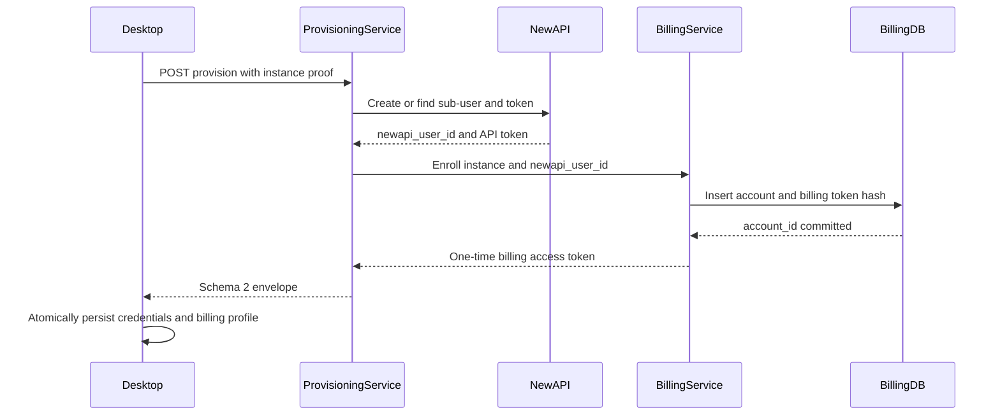
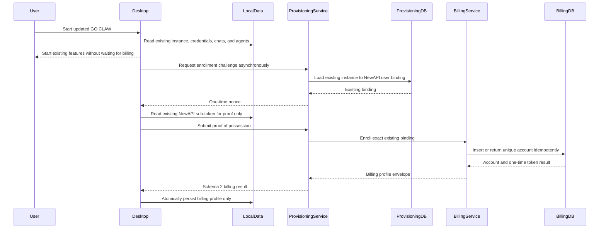
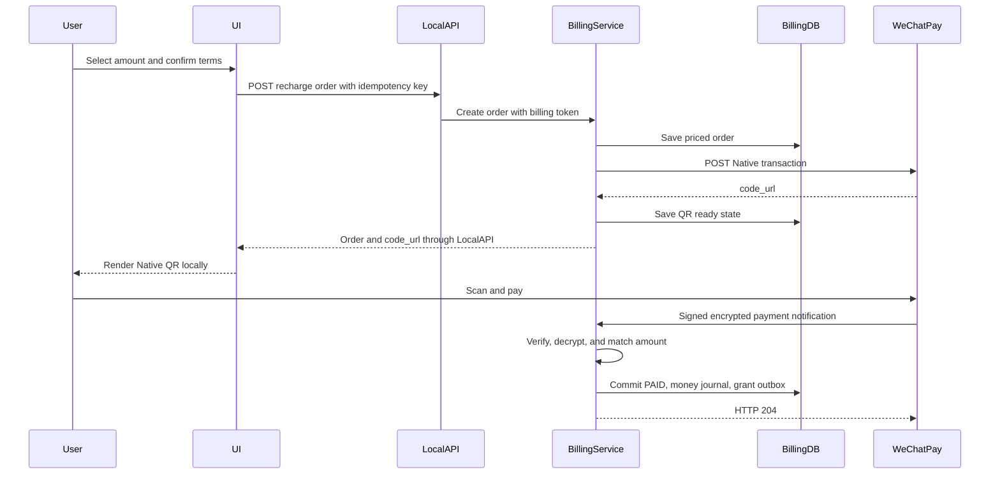
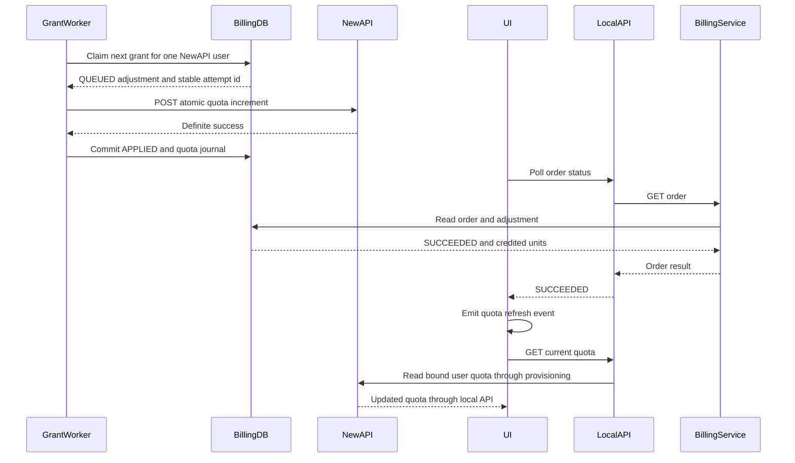
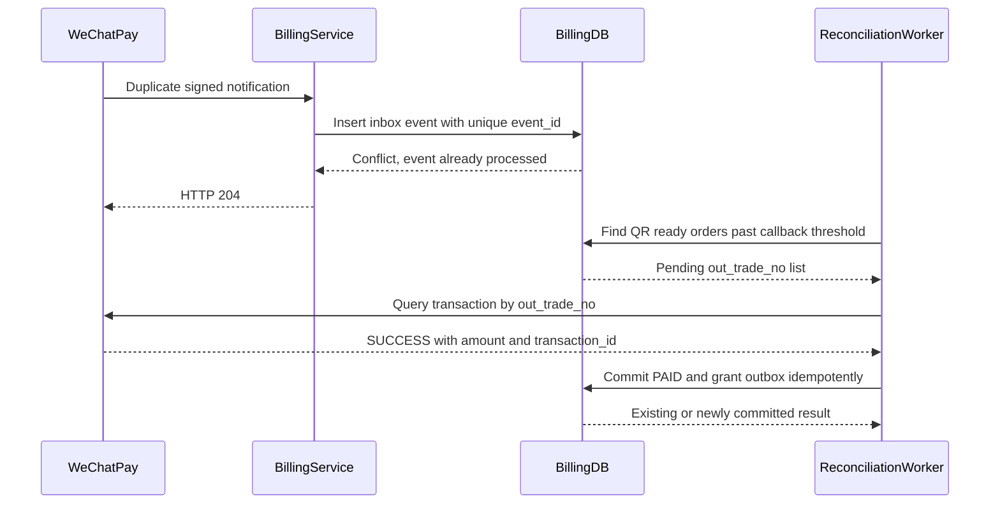
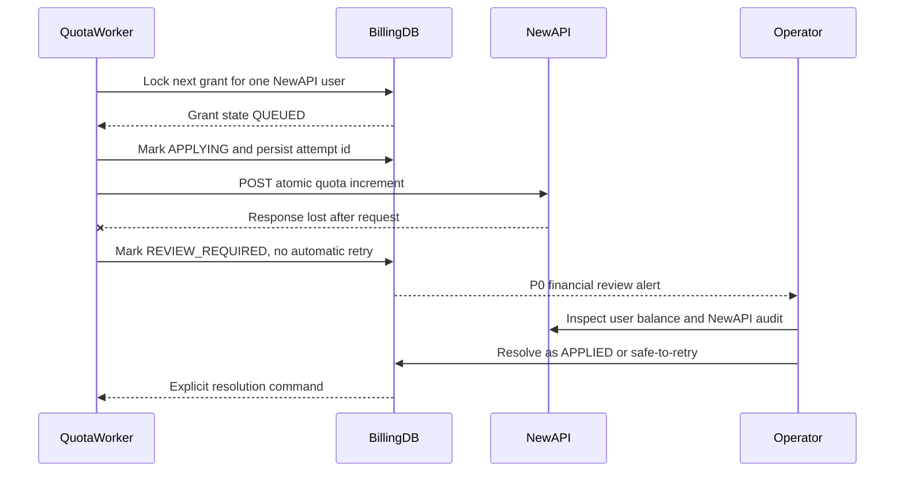
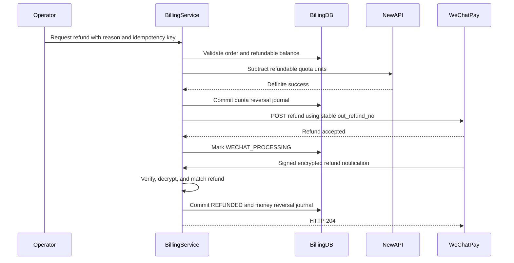
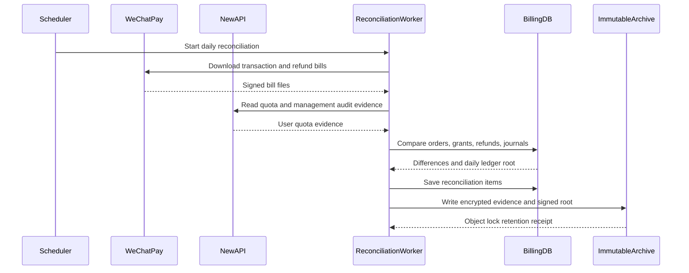

# GO CLAW “算力充值”详细设计

日期：2026-09-03
状态：产品合同已冻结；Phase 1 代码已落地，生产能力尚未启用
适用基线：GO CLAW v2.1.1；NewAPI `v1.0.0-rc.24`

配套合同：

- `../../contracts/compute-recharge/openapi.yaml`：客户端与计费服务 API 合同；
- `../../contracts/compute-recharge/provisioning-enrollment.openapi.yaml`：老用户无感开通 API 合同；
- `../../contracts/compute-recharge/events.schema.json`：内部事件合同；
- `../../contracts/compute-recharge/ledger.postgresql.sql`：账本与支付数据合同；
- `../../contracts/compute-recharge/GO-CLAW算力充值服务条款模板.zh-CN.md`：客户条款模板。

## 1. 结论

本功能应实现为“本地 GO CLAW 只负责展示与安全代理，公网 GO CLAW Billing Service 负责支付、账本、配额同步”的结构。微信支付商户私钥、APIv3 密钥和 NewAPI 管理员令牌绝不能进入 Windows 客户包、U 盘、前端 JavaScript、CI artifact 或普通日志。

首期产品规则固定为：

- 支付渠道：微信支付 API v3 Native；
- 计价币种：人民币，内部以分 `CNY_FEN` 保存；
- 用户展示换算固定为：`￥1 对应 500 万算力`；页面、订单和客户账本不展示美元或 NewAPI 原始 quota unit；
- 单笔充值下限固定为 `￥1`，上限固定为 `￥100,000`；
- 快速填充按钮固定为 `￥10 / ￥50 / ￥100 / ￥200`，同时允许范围内最多两位小数的自定义金额；
- 服务端内部仍按已确认的产品映射执行：`￥1 = $0.15` NewAPI 额度；该值不是实时汇率；
- NewAPI 官方额度单位：`$1 = 500,000 quota units`；
- 因此服务端内部精确换算为 `1 分人民币 = 750 quota units`，即 `newapi_quota_units = amount_fen × 750`；用户展示算力为 `display_compute_units = amount_fen × 50,000`；
- 所有金额与额度均使用整数，严禁 `float`；
- 订单创建时快照定价版本，之后调整价格不得改变历史订单；
- 只有微信支付验签、解密并核对商户号、订单号、币种和金额后，才能认定付款；
- 只有 NewAPI 增量调用得到确定成功结果后，才能显示“充值成功”；
- 任何结果不确定的下游调用都进入 `REVIEW_REQUIRED`，不得盲目重试造成重复加额或重复退款。

微信支付商户已由项目方开通。进入真实适配阶段时再向项目负责人索取 Native 支付所需配置，并通过安全渠道交接；设计、开发和 CI 阶段不得要求在聊天、Git、客户包或日志中提供任何生产密钥。

## 2. 现状事实与设计约束

### 2.1 已确认的项目事实

当前代码的真实链路是：

1. Windows portable 首次启动生成 `data/instance.id`；
2. `src/qwenpaw/app/go_claw_provision.py` 使用 Full ZIP 中 `provision.json` 的共享 HMAC 调用 provisioning 服务；
3. 服务端为每个实例创建独立 NewAPI 子用户和 token，并在 `provision.db` 保存 `instance_id → newapi_user_id` 映射；
4. `src/qwenpaw/app/routers/quota.py` 代理 `/api/console/quota`；
5. provisioning 服务从 NewAPI 读取 `users.quota` 与 `quota_data`，返回 `granted/remaining/percent`；
6. 前端 `console/src/layouts/QuotaBar.tsx` 每 60 秒刷新左下角额度条；
7. 客户版侧边栏入口由 `console/src/layouts/registry/builtinMenu.ts` 注册，路由由 `builtinRoutes.tsx` 注册。

生产 NewAPI 当前固定为 `v1.0.0-rc.24`。该版本的管理员接口 `POST /api/user/manage` 支持：

```json
{
  "id": 123,
  "action": "add_quota",
  "mode": "add",
  "value": 75000
}
```

`mode=add` 和 `mode=subtract` 都采用增量更新，并同步 NewAPI 自身缓存与管理审计。不得使用 `PUT /api/user/` 覆盖绝对 quota，也不得在 GO CLAW 中直接执行 `SET quota = ...`。

### 2.2 当前身份模型不能直接用于支付

`provision.json` 内共享 HMAC 随客户包分发，项目基线已明确它可被提取、不是强身份凭证。它可以继续用于低风险、幂等的首次开通，但不能用于：

- 查询充值历史；
- 创建绑定到具体账户的支付订单；
- 选择或变更 NewAPI 目标用户；
- 发起退款、冲正或账本操作。

充值功能必须新增每实例独立、随机、可吊销的 `billing_access_token`。服务端只保存 Argon2id 哈希，客户端明文只保存在 portable 数据目录的独立文件中。该 token 只允许操作服务端已绑定的账户，任何 API 都不接受客户端提交 `newapi_user_id`。

### 2.3 不修改生产源的边界

- 本设计不要求向 QwenPaw 源项目提交 PR；全部代码属于 GO CLAW 二开仓库。
- 首期不修改 NewAPI 源码，使用当前已存在的管理员增量接口。
- 若未来要让“请求已被 NewAPI 执行但 Billing Service 未收到响应”的极端场景也完全自动恢复，再实现 GO CLAW 自有的 NewAPI 幂等适配层；该适配层仍不向 QwenPaw 提交。
- 本设计阶段不修改生产 Nginx、微信商户配置、NewAPI 配额或支付回调地址。

## 3. 范围

### 3.1 本期范围

- 侧边栏新增“算力充值”入口；
- 展示当前剩余额度、固定换算规则、预设充值金额和自定义金额；
- 微信 Native 二维码支付；
- 支付成功后自动增加对应 NewAPI 用户额度；
- 订单状态与充值记录；
- 安全、不可变、可对账的双分录账本；
- 丢回调查单、重复回调、配额同步失败和订单过期补偿；
- 管理员退款/冲正流程与人工复核队列；
- 指标、告警、备份、恢复演练和发布门禁。

### 3.2 非本期范围

- 支付宝、银行卡、Apple Pay；
- 自动续费、订阅套餐、优惠券、赠送余额；
- 用户之间转赠额度；
- 客户端保存微信商户凭据；
- 使用实时人民币/美元汇率；
- 允许客户选择其他 NewAPI 用户作为到账目标；
- 前端直接访问微信支付或 NewAPI 管理 API；
- 自动批准退款。

## 4. 总体架构

```text
GO CLAW React UI
  │ localhost same-origin API
  ▼
GO CLAW 本地 FastAPI
  │ 读取 data/.go-claw-billing.json；TLS + Bearer
  ▼
GO CLAW Billing Service（公网服务端）
  ├─ PostgreSQL：订单、双分录账本、outbox/inbox、审计、对账
  ├─ Worker：查单、关单、配额同步、退款、日对账
  ├─ WeChat Pay Adapter：API v3 Native、回调验签解密、查单、关单、退款
  └─ NewAPI Adapter：管理员增量加额/减额；结果不确定时 fail closed
        │ 仅服务端管理网络
        ▼
      NewAPI v1.0.0-rc.24
```

### 4.1 责任边界

| 组件 | 允许持有 | 禁止持有 | 核心责任 |
| --- | --- | --- | --- |
| React UI | 订单 DTO、二维码内容、展示账本 | billing token、微信/ NewAPI 密钥 | 页面交互与轮询 |
| 本地 FastAPI | 实例 billing token | 微信商户私钥、NewAPI 管理员令牌 | 同源代理、严格 DTO、超时与脱敏日志 |
| Billing Service | 支付密钥引用、NewAPI 管理令牌、账本 | 客户 LLM token 明文日志 | 订单、验签、记账、配额与对账 |
| PostgreSQL | token 哈希、整数金额、审计记录 | 支付私钥明文 | 权威账本与状态 |
| NewAPI | 用户剩余额度 | 微信支付凭据 | 实际额度执行与用量扣减 |

### 4.2 部署边界

建议新增独立 `go-claw-billing.service`，监听 `127.0.0.1:9200`，由 Nginx 暴露：

- `/go-claw/billing/v1/*`：客户端充值 API；
- `/go-claw/billing/webhooks/wechatpay/transactions`：支付通知；
- `/go-claw/billing/webhooks/wechatpay/refunds`：退款通知；
- `/go-claw/billing/internal/*`：仅 loopback/mTLS，不对公网。

Billing Service 使用独立 PostgreSQL 数据库与最小权限角色，不复用 `provision.db` 或 `one-api.db` 作为账本。

## 5. 身份、开通与迁移

### 5.1 新实例

provisioning 响应升级为 envelope schema 2，但原有 `credentials.json` 继续保持 schema 1，避免破坏严格校验：

```json
{
  "schemaVersion": 2,
  "credentials": {
    "schemaVersion": 1,
    "batchId": "auto-12345678",
    "llm": {},
    "dashscope": {}
  },
  "billing": {
    "schemaVersion": 1,
    "accountId": "018f...",
    "baseUrl": "https://goclaw.host/go-claw/billing",
    "accessToken": "gcb_live_...",
    "issuedAt": "2026-09-03T00:00:00Z"
  }
}
```

客户端先完整验证 envelope，再分别原子写入：

- `GO-CLAW-Config/credentials.json`：仍为既有 schema 1；
- `data/.go-claw-billing.json`：计费凭证，Windows ACL 限当前用户，日志永不输出内容。

### 5.2 已开通 v2.1.1 实例

不能仅凭共享 HMAC 直接补发 billing token。迁移采用一次性 challenge：

1. 客户端以 `instance.id` 请求 enrollment challenge；该接口是公开的、强限流的，并对未知实例返回不可枚举的统一响应；若产品盘仍有 shared HMAC，只把它作为附加风控信号，绝不作为授权依据；
2. 服务端返回 32 字节随机 nonce，5 分钟过期且只能使用一次；
3. 客户端用现有 NewAPI 子 token 对 canonical challenge 做 HMAC；
4. provisioning 服务根据该实例已保存的 API key 验证 proof-of-possession；
5. Billing Service 创建/查询账户，返回一次性可见的 billing token；
6. 客户端原子写入计费凭证；
7. 服务端在独立 `billing_access_token` 表只保留 token 哈希、版本和状态；同一 account 可在安全轮换窗口内存在多个凭证，但都只能访问同一个已绑定 NewAPI 用户。

portable 产品允许 U 盘在不同电脑间移动，因此不能强制使用单台电脑 DPAPI 绑定。安全边界是“持有产品盘即持有该实例账户”；复制同一产品盘会共享同一 NewAPI 用户和充值余额，这一点需写入用户条款。

### 5.3 老用户无感开通合同

支持范围为已经拥有有效 `data/instance.id` 和现有 NewAPI 子 token 的 GO CLAW v2.0.1/v2.1.1 产品盘，包括没有 `provision.json` 的早期静态凭据包。用户通过正式在线更新升级到包含充值功能的版本后：

1. 启动主程序、聊天、数字员工和已有额度读取必须继续沿用原链路，不能等待 Billing enrollment；
2. 本地后端在既有 provisioning 成功后异步执行 `ensure_billing_enrollment()`；首次打开“算力充值”页面时也可触发同一个幂等流程；
3. 服务端必须按已有 `instance_id → newapi_user_id` 映射开通 Billing account，禁止创建新的 NewAPI 用户、重置 token、覆盖 quota 或迁移聊天记录；
4. `billing_account.instance_id` 与 `newapi_user_id` 均唯一；重复 enrollment 返回同一个 account，绝不产生第二个到账目标；
5. enrollment 成功后，将 billing profile 先写同目录临时文件、flush/fsync，再原子替换 `data/.go-claw-billing.json`；
6. enrollment 失败只影响充值页，页面显示“充值服务初始化中/暂不可用，可重试”，不得影响聊天、模型、员工、技能、额度条和在线更新；
7. 后台仅对 `RETRYABLE` 状态按指数退避；身份映射冲突、proof 不匹配或配置损坏进入 `ATTENTION_REQUIRED`，禁止自动创建替代账户；
8. 更新器 preserve-list 必须保留整个 `data`、`GO-CLAW-Config`、聊天记录、`instance.id`、credentials 和 `.go-claw-billing.json`；回滚同样不得删除新 profile；
9. 新 token 初始为 `ISSUED`，首次成功鉴权后原子转为 `ACTIVE`；未首次使用的 token 24 小时后失效。旧 token 在新 token 首次鉴权成功前保持有效，避免响应丢失或落盘失败把老用户锁死；
10. UI 不弹出强制迁移对话框、不要求再次登录或重新购买；仅在充值页确实无法自动恢复时提供带 `trace_id` 的联系客服入口。

enrollment URL 是非秘密的版本化应用配置，随 Full ZIP 和在线更新代码发布，不依赖老产品盘是否存在 `provision.json`。它不能包含 shared HMAC、Billing token 或任何商户密钥。

客户端迁移状态固定为：

```text
NOT_STARTED → ENROLLING → READY
                    ├→ RETRYABLE → ENROLLING
                    └→ ATTENTION_REQUIRED
```

`READY` 之前充值入口仍可见，但禁用建单并显示初始化状态；其他 GO CLAW 功能不读取该状态。

### 5.4 兼容发布顺序

1. 先部署 Billing DB、API、webhook、worker 和 schema 1/2 兼容的 provisioning，保持 `recharge_order_creation=false`；
2. 对现网实例执行只读映射审计，确认 `instance_id/newapi_user_id` 唯一且不存在空映射；
3. 发布支持异步 enrollment 的客户端更新，先让老用户获得 billing profile；
4. 观察 enrollment 成功率、冲突率和原有聊天/额度指标；
5. 仅在服务端、回调和 worker 就绪后灰度开启建单；
6. 回滚时只关闭新建订单，已付款订单的回调、查单、配额发放、退款与对账继续运行；
7. provisioning 至少保留一个完整发布周期的 schema 1 客户端兼容，不能因开启 schema 2 使未及时更新的老版本失效。

## 6. 定价与金额合同

### 6.1 精确计算

```text
用户展示:     1 CNY = 5,000,000 display compute units
              1 fen = 50,000 display compute units

服务端映射:   1 CNY = 0.15 USD NewAPI quota
NewAPI:       1 USD = 500,000 quota units
内部执行:     1 CNY = 75,000 NewAPI quota units
              1 fen = 750 NewAPI quota units

display_compute_units = checked_int64(amount_fen * 50_000)
newapi_quota_units     = checked_int64(amount_fen * 750)
```

这两个单位是同一价格策略的两份快照，不能互相替代：

- `DISPLAY_COMPUTE_UNIT` 是客户可见的产品单位；
- `NEWAPI_QUOTA_UNIT` 只用于服务端向 NewAPI 发放和对账；
- 客户请求只能提交 `amount_fen`，不得提交任一额度值；
- 服务端必须从同一个 `pricing_policy` 同时计算两者，禁止从 UI 文案反向解析额度；
- 对当前 NewAPI 剩余额度换算展示算力时，使用有理数 `200/3` 并向下取整：`display_remaining = floor(newapi_remaining × 200 / 3)`；计算须采用 checked int64/大整数，禁止浮点误差；
- 购买记录中的展示算力使用订单快照，不使用余额换算结果回推。

示例：

| 实付 | amount_fen | 用户展示算力 | 内部 NewAPI quota units |
| ---: | ---: | ---: | ---: |
| ￥1 | 100 | 5,000,000 | 75,000 |
| ￥10 | 1,000 | 50,000,000 | 750,000 |
| ￥50 | 5,000 | 250,000,000 | 3,750,000 |
| ￥100 | 10,000 | 500,000,000 | 7,500,000 |
| ￥200 | 20,000 | 1,000,000,000 | 15,000,000 |
| ￥100,000 | 10,000,000 | 500,000,000,000 | 7,500,000,000 |

### 6.2 定价版本

`pricing_policy` 一经订单引用不得修改，只能创建新版本。订单必须快照：

- `pricing_policy_id`；
- `pricing_version`；
- `display_compute_units_per_fen=50,000`；
- `newapi_quota_units_per_fen=750`；
- `amount_fen`；
- `display_compute_units`；
- `newapi_quota_units`；
- `currency=CNY`；
- `terms_version`。

首期单笔边界已确认为最低 `￥1`、最高 `￥100,000`；快速填充为 `￥10/￥50/￥100/￥200`。自定义金额按人民币分精确提交，最多两位小数，即 `100 ≤ amount_fen ≤ 10,000,000`。服务端配置是权威来源，前端可做同样校验但不能替代服务端校验。每日累计风控上限尚待确认，未确认前不得用未经批准的数值阻断合法单笔订单；可以先启用频率限制、异常告警和人工风控。

## 7. 页面与交互设计

### 7.1 侧边栏

在 `core.settings-group` 下新增：

- id：`core.compute-recharge`；
- 路由：`/compute-recharge`；
- 文案：`算力充值`；
- 图标：复用当前图标包的 `SparkDataLine`，避免新增外部资源；
- order：`5`，位于“数字员工管理”之前；
- 客户精简模式与完整模式均可见。

### 7.2 页面布局

沿用现有 Settings 页的白色卡片、圆角、字号、间距和橙色品牌色，不创建独立视觉体系：

1. 顶部标题“算力充值”，副文案固定为“￥1对应500万算力”；
2. 当前额度卡：剩余算力、当前百分比、立即刷新；不出现美元或 NewAPI quota unit；
3. 金额卡：￥10 / ￥50 / ￥100 / ￥200 快速填充按钮，以及 ￥1–￥100,000 范围内、最多两位小数的自定义金额；
4. 订单确认区：实付人民币、到账算力、定价版本与条款勾选；
5. Native 支付弹窗：本地生成二维码、倒计时、订单号、状态提示；
6. 充值记录表：时间、实付、到账、状态、订单号、操作；
7. 异常状态明确区分“未支付”“已付款到账中”“需人工处理”，禁止把到账延迟误报为支付失败。

金额组件的交互合同：快速按钮只负责填充输入框，用户仍需点击“立即充值”确认；输入支持千分位和最多两位小数展示，但请求只发送人民币分整数 `amountFen`；空值、小于 ￥1、大于 ￥100,000、超过两位小数、科学计数法、负数和超长数字均在前后端拒绝。金额或定价版本变化后必须重新生成订单，旧二维码不能复用。

二维码必须由打包在前端的本地库生成，不调用第三方二维码图片服务。仅接受 `weixin://` 且符合微信 Native URL 形状的 payload；禁止把二维码字符串当普通 URL 自动打开。

### 7.3 轮询与额度刷新

- 支付弹窗打开后：前 30 秒每 2 秒查一次，之后每 5 秒查一次；页面后台时降为 15 秒；
- 达到 `SUCCEEDED/EXPIRED/CLOSED/REFUNDED/REVIEW_REQUIRED` 后停止轮询；
- `SUCCEEDED` 后派发 `go-claw:quota-updated` 事件，`QuotaBar` 立即刷新；
- 60 秒常规额度轮询保留；
- 关闭弹窗不关闭订单，订单仍由服务端回调或查单完成。

## 8. 状态机

### 8.1 支付订单

```text
CREATED → QR_READY → PAID
   │          │
   └──────────┴→ EXPIRED → CLOSED

任意无法确认的支付结果 → PAYMENT_REVIEW_REQUIRED
```

规则：

- 只有已验证微信回调或服务端主动查单结果可进入 `PAID`；
- 客户端轮询结果、二维码扫描动作和前端“完成”按钮都不能进入 `PAID`；
- 同一 `out_trade_no` 只能对应一个金额和一个 account；
- `transaction_id` 全局唯一；
- 过期订单查单确认仍为 `NOTPAY` 后才关单。

### 8.2 配额发放

```text
NOT_REQUESTED → QUEUED → APPLYING → APPLIED
                              └→ REVIEW_REQUIRED
APPLIED → REVERSING → REVERSED
                    └→ REVIEW_REQUIRED
```

规则：

- `PAID` 与 `quota grant QUEUED` 在同一个本地数据库事务中提交，并写 outbox；
- 远程 NewAPI 调用不得放在该数据库事务内；
- 同一 NewAPI 用户的 adjustment 串行执行；
- 明确的 4xx 可标记失败并人工处理；连接建立前失败可安全重试；
- 发送后超时、连接中断或进程崩溃属于结果不确定，不得自动再次调用非幂等 NewAPI 接口；
- 客户状态在 `APPLIED` 前统一显示“已付款，额度同步中”。

### 8.3 退款

```text
NONE → REQUESTED → QUOTA_REVERSING → QUOTA_REVERSED
                                      → WECHAT_PROCESSING → REFUNDED
                                                           └→ REVIEW_REQUIRED
```

退款顺序固定为“先安全撤回可退款额度，再调用微信退款”。如果用户已消耗相应额度，进入人工审核，不自动形成负余额。微信退款受理成功不等于退款成功，必须以退款通知或查询结果为准。

## 9. 完整时序图

图表按一张图一个流程拆分，避免正常、异常和退款互相遮蔽。

### 9.1 新实例计费账户开通



### 9.2 老用户在线更新后无感开通



### 9.3 Native 下单与支付确认



### 9.4 配额自动到账与 UI 同步



### 9.5 重复回调与丢回调补偿



### 9.6 NewAPI 结果不确定时的安全处理



### 9.7 管理员退款



### 9.8 日终对账与账本封存



## 10. 微信支付合同

### 10.1 下单

服务端调用：

```text
POST https://api.mch.weixin.qq.com/v3/pay/transactions/native
```

请求至少包含 `appid`、`mchid`、`description`、`out_trade_no`、`notify_url`、`amount.total`、`amount.currency=CNY` 和 `time_expire`。`out_trade_no` 为 6–32 个允许字符且在商户号下唯一。响应 `code_url` 只用于本地生成二维码。

建议业务订单有效期 10 分钟。二维码过期后新建新订单号，旧订单先查单，确认未支付后再关单。

### 10.2 回调

接收回调时必须：

1. 按原始 body bytes 与 `Wechatpay-Timestamp/Nonce/Serial/Signature` 验签；
2. 检查时间窗和重复 event id；
3. 使用 APIv3 密钥解密 `AEAD_AES_256_GCM` resource；
4. 比较 `appid/mchid/out_trade_no/amount.total/currency`；
5. 唯一保存 `transaction_id`；
6. 在本地事务提交后 5 秒内返回 200 或 204；
7. 重复通知直接返回成功，不重复记账或加额。

微信官方明确要求回调验签、金额核对、重复通知幂等，并建议未收到回调时主动查单。参考：

- [Native 下单](https://pay.wechatpay.cn/doc/v3/merchant/4012791877)
- [Native 支付开发指引](https://pay.wechatpay.cn/doc/v3/merchant/4012791891)
- [API v3 签名与验签](https://pay.wechatpay.cn/doc/v3/merchant/4012365342)
- [商户订单号查单](https://pay.wechatpay.cn/doc/v3/merchant/4012791880)

### 10.3 退款

退款使用固定 `out_refund_no` 幂等调用微信 `POST /v3/refund/domestic/refunds`。接口受理成功只表示进入处理流程，最终以退款回调或查单为准。重复通知按 `event_id/refund_id/out_refund_no` 去重。参考：

- [申请退款](https://pay.wechatpay.cn/doc/v3/merchant/4012587971)
- [退款结果通知](https://pay.wechatpay.cn/doc/v3/merchant/4012268885)

### 10.4 商户配置交接

项目方已确认微信支付商户已开通。真实联调开始前，由实施人联系项目负责人完成一次配置清单核验：

| 配置 | 用途 | 保存位置 |
| --- | --- | --- |
| 商户号 `mchid` | 下单、查单、退款 | 服务端 secret/config |
| 已绑定的 `appid` | Native 下单与回调核对 | 服务端 config |
| 商户 API 证书序列号 | 请求签名 | 服务端 config |
| 商户 API 私钥 | 请求签名 | KMS/Vault/systemd credential |
| APIv3 密钥 | 通知解密 | KMS/Vault/systemd credential |
| 微信支付平台公钥/证书及序列号 | 回调验签 | 受控证书目录/自动轮换存储 |
| 公网 HTTPS `notify_url` | 支付与退款通知 | Nginx/Billing config |
| 商户展示名称和客服信息 | 收银台、条款、客服 | 版本化业务配置 |

交接规则：不在聊天窗口粘贴私钥或 APIv3 密钥；不通过普通邮件发送明文；不写入 `.env.example`；首次配置后执行权限检查、签名 smoke、回调验签 smoke 和密钥轮换演练。开发人员只需要 fake merchant 配置，生产凭据仅在 staging/production 部署阶段注入。

## 11. NewAPI 配额同步合同

### 11.1 单位

NewAPI 文档将 `$1` 定义为 `500,000 quota points`。本功能只传整数 `value`。参考 [NewAPI Rate Settings](https://github.com/QuantumNous/new-api-docs/blob/main/docs/en/guide/console/settings/rate-settings.md)。

### 11.2 当前适配

Billing Service 的 NewAPI Adapter 调用管理员接口：

```text
POST /api/user/manage
Authorization: Bearer <admin token>
New-Api-User: <admin user id>
Content-Type: application/json
```

加额：

```json
{"id": 123, "action": "add_quota", "mode": "add", "value": 75000}
```

减额：

```json
{"id": 123, "action": "add_quota", "mode": "subtract", "value": 75000}
```

当前 `v1.0.0-rc.24` 源码的 add/subtract 路径使用 `IncreaseUserQuota/DecreaseUserQuota` 增量更新。它解决并发消费下的绝对值覆盖问题，但请求自身没有外部业务幂等键。

### 11.3 非幂等下游规则

- `quota_adjustment.adjustment_id` 在 Billing DB 唯一；
- 同一 `newapi_user_id` 只允许一个 `APPLYING`；
- 调用前持久化 attempt，调用成功后再持久化结果；
- HTTP 明确成功：记 `APPLIED`；
- HTTP 明确业务失败：记 `FAILED_RETRYABLE` 或 `REVIEW_REQUIRED`；
- DNS、连接建立前失败：指数退避重试；
- 发送后超时、EOF、进程崩溃：记 `REVIEW_REQUIRED`，禁止自动重发；
- 运维通过 NewAPI 用户余额、管理审计、时间窗和 Billing journal 复核后，显式执行“确认已到账”或“允许重试”；
- 每次人工决策写不可变审计记录，必须包含操作人、原因、证据哈希和前后状态。

未来幂等适配层合同为 `POST /internal/quota-adjustments`，以 `adjustment_id` 为唯一键，在 NewAPI 侧事务内同时完成“记录 operation + 增量额度”。在该能力上线前，不得把结果不确定调用自动重试。

## 12. 账本设计

### 12.1 权威来源

- 微信支付：资金实际支付/退款权威来源；
- Billing PostgreSQL：GO CLAW 订单、定价快照、双分录账本、配额发放意图与审计权威来源；
- NewAPI：实时可消费额度与用量权威来源；
- 前端、本地缓存、`QuotaBar`：均不是权威来源。

### 12.2 双分录

每个 journal 必须按 `asset_code` 分别满足 `sum(debit) = sum(credit)`。不同资产不得互相抵消。

付款 ￥10：

| 资产 | 借方 | 贷方 | 数量 |
| --- | --- | --- | ---: |
| CNY_FEN | `wechat_clearing` | `customer_prepayment` | 1,000 |

服务端发放等价 `$1.50` 的 NewAPI 内部额度：

| 资产 | 借方 | 贷方 | 数量 |
| --- | --- | --- | ---: |
| NEWAPI_QUOTA_UNIT | `platform_quota_issuance` | `customer_quota:{account_id}` | 750,000 |

用户侧同时展示该 ￥10 订单到账 `50,000,000` 算力。`DISPLAY_COMPUTE_UNIT` 是订单定价快照和展示单位，不是另一份可独立消费资产，因此不另建一套可冲抵的双分录余额；客户账本从不可变订单快照读取它，NewAPI 实际发放与对账仍只使用 `NEWAPI_QUOTA_UNIT`。

退款与配额撤回使用原 journal 的 reversal，不更新或删除原 journal。

### 12.3 不可变与防篡改

- `journal_entry/journal_line/audit_event` 只允许 INSERT；数据库触发器拒绝 UPDATE/DELETE；
- 更正只能新增 reversal；
- 每条 journal 保存 `previous_hash/entry_hash/key_version`，对 canonical payload 做 HMAC；
- 每日计算 Merkle/root hash，使用独立签名密钥签名；
- 日根、微信账单、对账结果和审计导出加密写入开启 Object Lock/WORM 的异地对象存储；
- hash chain 只能发现篡改，不能替代数据库权限、异地备份和恢复演练；
- 应用 DB 角色无 DDL、无 ledger UPDATE/DELETE；迁移角色与运行角色分离；
- 所有时间为 UTC timestamptz，UI 转 Asia/Shanghai；
- PII 最小化：不在客户账本展示或普通日志记录 payer openid、完整 transaction id、token 或二维码内容。

### 12.4 幂等键

| 对象 | 唯一键 |
| --- | --- |
| 客户建单 | `(account_id, idempotency_key)` |
| 微信商户订单 | `out_trade_no` |
| 微信交易 | `wechat_transaction_id` |
| 微信通知 | `event_id` |
| 配额发放 | `order_id` 与 `adjustment_id` |
| 退款 | `out_refund_no` |
| 退款通知 | `refund_event_id` 或 `refund_id` |
| outbox | `event_id` |

## 13. 对账与运维

### 13.1 在线补偿

- 每分钟扫描 2 分钟以上仍 `QR_READY` 的订单并查单；
- 每分钟扫描 `PAID + grant not APPLIED`；
- 订单过期后先查单再关单；
- outbox 使用 `FOR UPDATE SKIP LOCKED` 分片消费；
- 失败使用指数退避与抖动；结果不确定不自动重试；
- worker 与 HTTP 进程可独立重启，不丢任务。

### 13.2 日终对账

每天至少完成三方核对：

1. 微信交易账单/退款账单 vs `payment_order/refund`；
2. `payment_order.PAID` vs CNY journal；
3. `quota_adjustment.APPLIED` vs QUOTA journal；
4. 发放总额 vs NewAPI 管理审计；
5. 当前 NewAPI `remaining + net consumption` vs 客户总签发口径。

差异分级：

- P0：微信已付款但 10 分钟未到账、重复加额、退款成功但额度未撤回、账本不平；
- P1：回调缺失但查单可补、单笔审计证据缺失、WORM 导出失败；
- P2：UI 轮询失败、展示延迟、非关键指标缺失。

### 13.3 备份与恢复

- PostgreSQL：每日全量 + 持续 WAL/PITR，异地加密保存；
- RPO 目标 ≤ 5 分钟，RTO 目标 ≤ 60 分钟；
- 每季度执行恢复演练，验证到具体订单和 journal hash；
- 微信/API 密钥独立备份与轮换，不进入数据库备份；
- 恢复后先只读对账，再开放建单与 worker。

## 14. 安全控制

### 14.1 密钥

- 商户私钥、APIv3 key、NewAPI 管理令牌通过 KMS/Vault 或 systemd `LoadCredential=` 挂载；
- 文件权限 root:service、`0600`；
- 支付服务使用独立 Linux 用户；
- 密钥有 `key_version`，支持双钥轮换；
- 错误、trace、APM、Sentry 和审计不得记录 secret 或完整请求头。

### 14.2 API

- 全链路 TLS；Billing token 至少 256 bit 熵；服务端只存 Argon2id 哈希；
- token 支持吊销、轮换、最后使用时间和异常 IP 告警；
- 创建订单按账户/IP/设备速率限制；
- `Idempotency-Key` 长度和字符集严格校验，24 小时内同 key 同 body 返回同结果，不同 body 返回 409；
- 金额只从服务端定价计算，客户端提交的展示额度全部忽略；
- webhook 限 body 大小，先保存 hash 后处理，严格验签；
- 管理退款使用 MFA、RBAC、双人复核和原因字段；
- 管理页面与客户页面分域或至少分权限策略。

### 14.3 供应链

- 微信支付 SDK、二维码库、密码哈希库锁版本并做许可证/SBOM 扫描；
- CI 使用假 WeChat/NewAPI server，不读取生产密钥；
- 正式 smoke 只做 ¥0.01/沙箱能力允许的最小受控交易；若微信商户不支持沙箱，使用明确标记的财务测试订单并当日退款对账。

## 15. API 与事件合同摘要

完整字段见配套合同。客户可调用的核心 API：

| 方法 | 路径 | 说明 |
| --- | --- | --- |
| GET | `/v1/config` | 定价、金额范围、预设项、条款版本 |
| GET | `/v1/balance` | 当前 NewAPI 额度摘要 |
| POST | `/v1/orders` | 幂等创建 Native 支付订单 |
| GET | `/v1/orders/{order_id}` | 订单与到账状态 |
| POST | `/v1/orders/{order_id}/close` | 用户主动关闭未付款订单 |
| GET | `/v1/orders` | 客户充值记录 |
| GET | `/v1/ledger` | 客户可见账本条目 |

本地 FastAPI 以 `/api/console/recharge/*` 镜像上述合同并代理到 Billing Service。微信回调使用独立 webhook 路径，不接受 billing token。

老用户后台迁移使用 provisioning 的独立合同：

| 方法 | 路径 | 说明 |
| --- | --- | --- |
| POST | `/go-claw/provision/billing/challenges` | 创建不可枚举、5 分钟、单次使用的 challenge |
| POST | `/go-claw/provision/billing/enrollments` | 验证既有 NewAPI 子 token 的 proof，并为原绑定签发 Billing profile |

这两个端点不经过 React，不向浏览器返回 proof、NewAPI token 或 Billing token。

标准错误采用 `application/problem+json`，至少包含 `type/title/status/code/traceId`；不得把上游原始错误或密钥信息透传给 UI。

## 16. 精确代码修改计划

### 16.1 前端

| 文件 | 修改 |
| --- | --- |
| `console/src/layouts/registry/builtinMenu.ts` | 新增 `core.compute-recharge`，settings order 5，精简模式可见 |
| `console/src/layouts/registry/builtinRoutes.tsx` | lazy import 页面并注册 `/compute-recharge` |
| `console/src/api/modules/recharge.ts` | 严格定义 config/order/ledger DTO 与 API 方法 |
| `console/src/pages/Settings/ComputeRecharge/index.tsx` | 页面容器、状态机、轮询与刷新 |
| `console/src/pages/Settings/ComputeRecharge/components/*` | 余额卡、金额卡、NativePayModal、LedgerTable |
| `console/src/layouts/QuotaBar.tsx` | 监听 `go-claw:quota-updated` 并立即刷新 |
| `console/src/locales/zh.json`、`en.json` | 导航、状态、错误和无障碍文案 |
| `console/package.json` | 增加锁定版本的本地 QR 生成库；不得使用远程二维码服务 |
| `console/src/layouts/registry/builtinMenu.test.ts` | 断言充值入口在客户模式可见 |
| `console/src/pages/Settings/ComputeRecharge/*.test.tsx` | 金额换算、幂等、轮询终止、异常状态、额度刷新测试 |

### 16.2 本地后端

| 文件 | 修改 |
| --- | --- |
| `src/qwenpaw/app/go_claw_billing.py` | billing profile 严格解析、非秘密 enrollment URL、异步 `ensure_billing_enrollment()`、token 读取与脱敏 HTTP client |
| `src/qwenpaw/app/routers/recharge.py` | `/console/recharge/*` 同源代理，限定 portable 与已开通实例 |
| `src/qwenpaw/app/routers/__init__.py` | 注册 recharge router |
| `src/qwenpaw/app/go_claw_provision.py` | 支持 schema 2 envelope 并原子写 billing profile |
| `src/qwenpaw/app/go_claw_credentials.py` | 不改变 schema 1；仅复用 credentials 子对象验证 |
| `tests/unit/app/routers/test_recharge_router.py` | token 不出进程、404/401/429/503 映射、超时与脱敏 |
| `tests/unit/app/test_go_claw_provision.py` | schema 1 兼容、schema 2 双文件原子性、v2.0.1/v2.1.1 无感 enrollment、损坏恢复 |

### 16.3 服务端

| 文件/目录 | 修改 |
| --- | --- |
| `scripts/billing/go_claw_billing/` | 新建 FastAPI 服务，按 domain/application/adapters 分层 |
| `scripts/billing/migrations/` | PostgreSQL 迁移，基于账本 SQL 合同实现 |
| `scripts/billing/adapters/wechatpay.py` | Native 下单、验签解密、查单、关单、退款、账单下载 |
| `scripts/billing/adapters/newapi.py` | rc.24 管理增量接口、每用户串行、结果不确定分类 |
| `scripts/billing/workers/` | outbox、查单、关单、quota、refund、daily reconciliation |
| `scripts/provisioning/provision_server.py` | schema 2 开通、新实例 account enrollment、存量 challenge |
| `deploy/systemd/go-claw-billing.service` | 独立用户、只读文件系统、credential mount、健康检查 |
| `deploy/nginx/go-claw-billing.conf` | 客户 API 与 webhook 精确 location、body/rate limit |
| `scripts/billing/tests/` | 单元、合同、故障注入、并发、恢复与对账测试 |

### 16.4 CI/CD

- OpenAPI lint + breaking-change check；
- JSON Schema 校验；
- PostgreSQL migration up/down 与不可变触发器测试；
- 微信签名、错误签名、签名探测、重复回调、金额不一致测试；
- 100 并发相同 `Idempotency-Key` 只生成一个订单；
- 100 重复通知只产生一组 money/grant journal；
- worker 在每个事务边界 crash/restart 的故障注入；
- NewAPI 响应丢失必须进入 `REVIEW_REQUIRED`，不得二次调用；
- Full ZIP 验证不得包含任何支付私钥、APIv3 key、NewAPI admin token 或服务端 `.env`；
- updater payload 不覆盖 `data/.go-claw-billing.json`；
- 不配置生产 secret 的 PR CI 也必须完全通过。

## 17. 测试矩阵

| 层级 | 必测用例 |
| --- | --- |
| 金额 | ￥1/1.01/10/50/100/200/99,999.99/100,000、越界/三位小数拒绝、溢出、双单位与定价版本不漂移 |
| 身份 | 无 token、错 token、吊销、存量 challenge 重放、跨 instance 访问 |
| 微信 | 正常回调、重复回调、错签名、过期时间戳、金额/商户不一致、丢回调查单 |
| 订单 | 同 key 同 body、同 key 异 body、并发建单、过期关单、支付与关单竞态 |
| NewAPI | add 成功、明确失败、连接前失败、发送后超时、进程 crash、同用户串行 |
| 账本 | 每资产平衡、不可更新删除、reversal、hash chain、日根封存 |
| 退款 | 未消费全退、部分消费人工审、重复退款、退款通知重复、退款异常 |
| UI | 二维码本地生成、倒计时、后台降频、到账立即刷新、异常文案、无障碍 |
| 发布 | 客户包 secret 扫描、在线更新保留 billing profile、旧 v2.1.1 自动迁移 |

## 18. 分阶段实施

### Phase 0：前置审批与测试环境

- 微信商户号、appid 绑定、API 证书/APIv3 key、公网 notify 域名；
- 财务确认定价、单笔/日限额、退款与发票流程；
- 法务审阅条款、隐私、退款和争议处理；
- 安全评审威胁模型和密钥托管；
- 建立独立测试 merchant/config，禁止直接用生产做开发联调。

### Phase 1：Billing 核心与合同

- PostgreSQL 迁移、账本、outbox/inbox、订单与定价；
- fake WeChat/NewAPI adapters；
- API/事件合同测试；
- worker crash/restart 测试。

### Phase 2：真实适配与存量迁移

- 接入微信 Native、查单、关单、退款；
- 接入 NewAPI rc.24 管理增量；
- provisioning schema 2 与 v2.1.1 challenge；
- 与项目负责人完成微信商户配置清单和安全注入，不把密钥带入仓库或构建产物；
- staging 小额闭环与日终对账。

### Phase 3：客户端 UI

- 侧边栏、页面、二维码、轮询、记录；
- QuotaBar 即时刷新；
- portable/在线更新回归。

### Phase 4：灰度与正式开放

- 内部账户 → 5% 实例 → 25% → 100%；
- feature flag 可只关闭建单，不影响已付款订单的回调与到账 worker；
- 每阶段至少完成一次真实支付、到账、退款、对账；
- P0 指标为零且无未解释差异后继续放量。

## 19. 上线门禁与验收标准

- [ ] 微信商户资质、appid 绑定、支付产品权限和 notify 域名已确认；
- [ ] 条款、退款、隐私、发票与客服流程通过业务/法务评审；
- [ ] 客户包和日志 secret 扫描为零；
- [ ] 配置返回 `minAmountFen=100`、`maxAmountFen=10,000,000`、`amountStepFen=1`、快捷金额 `1,000/5,000/10,000/20,000` 分；
- [ ] ￥1 订单向用户展示 5,000,000 算力，服务端精确发放 75,000 NewAPI quota units；
- [ ] ￥100,000 边界订单计算为 500,000,000,000 展示算力和 7,500,000,000 NewAPI units，无溢出；
- [ ] ￥0、￥0.99、￥100,000.01、￥100,001、三位小数和伪造额度字段均被拒绝，￥1.01 可按分精确下单；
- [ ] 同一回调发送 100 次只到账一次；
- [ ] 丢回调后查单自动到账；
- [ ] NewAPI 响应丢失不重复加额并触发 P0 复核；
- [ ] 每个 journal 按资产平衡，原记录不能 UPDATE/DELETE；
- [ ] 退款先撤额度、后退资金，重复调用不重复退款；
- [ ] v2.0.1/v2.1.1 存量产品盘无需清空聊天记录、重建员工或更换 NewAPI 用户即可自动补发 billing token；
- [ ] 在线更新保留 `data`、凭据、聊天记录与 billing profile；
- [ ] enrollment 服务不可用时原有聊天、员工、模型与额度条仍可使用；恢复后无需用户操作即可转为 `READY`；
- [ ] PostgreSQL PITR 和 WORM 证据恢复演练通过；
- [ ] staging 至少连续 7 天零账差后才允许全量上线。

## 20. 待业务确认项

已确认：单笔最低 ￥1、最高 ￥100,000；快捷金额 ￥10/￥50/￥100/￥200；用户展示“￥1对应500万算力”；每账户每日累计充值上限 ￥100,000；用户侧不提供退款申请入口，客户通过微信或购买所在电商平台联系客服，具体退款金额由客服人工核定并由内部运维入口发起；暂不提供发票；微信支付商户号为 `1749383281`；GO CLAW 唯一下单 AppID 为“未来AI工坊” `wx04d715aaaa2bd0ed`。

2026-09-03 关联记录：商户号与两个小程序 AppID 的跨主体关联均已由小程序管理员完成授权。GO CLAW 仅允许“未来AI工坊” `wx04d715aaaa2bd0ed` 用于下单及回调验签；另一个已关联 AppID 不得用于 GO CLAW，生产配置对此 fail closed。

2026-09-03 API 安全材料核验：Native 支付已开通；商户 API 证书包结构完整，证书序列号为 `2B377C2097D105A0B7958395AE39D15E89472612`，有效期至 2031-09-02；微信支付公钥 PEM 可解析，公钥ID为 `PUB_KEY_ID_0117493832812026090300182221000205`；APIv3 密钥已由负责人安全保存。商户私钥和 APIv3 密钥不得写入本文档、仓库、构建产物或日志。

其余参数不阻塞代码骨架，但上线前必须签字确认：

1. 微信 API 证书/平台公钥方案、APIv3 密钥和正式 notify 域名；
2. 未消费额度、部分消费额度与异常订单的客服退款政策；
3. 账户/U 盘遗失后的身份核验和 token 吊销流程；
4. 客服联系方式、服务时间和账务争议升级人；
5. WORM 保存年限、数据库备份保存年限和 PII 保存年限；
6. 是否接受首期“NewAPI 结果不确定进入人工复核”，或必须先建设下游幂等适配层再上线。
