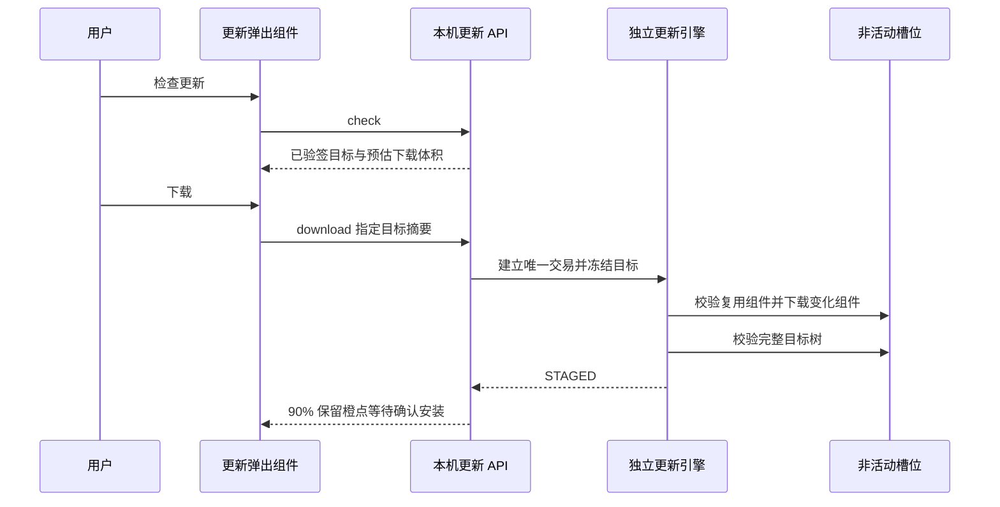
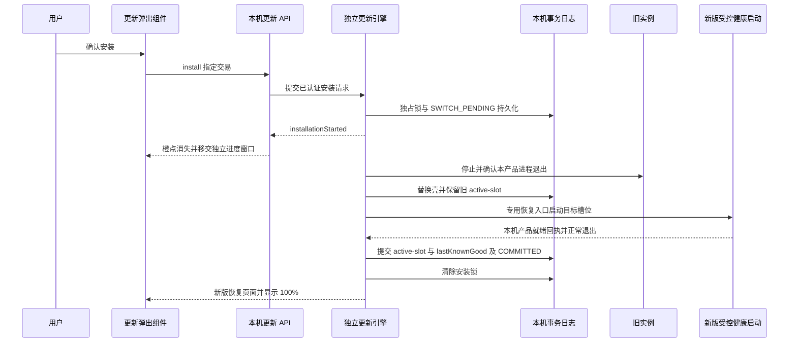
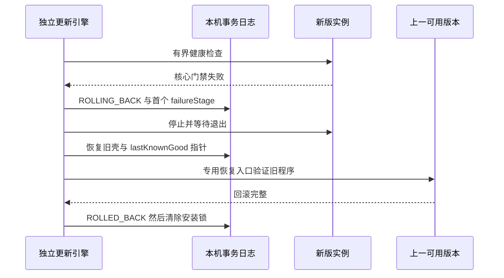
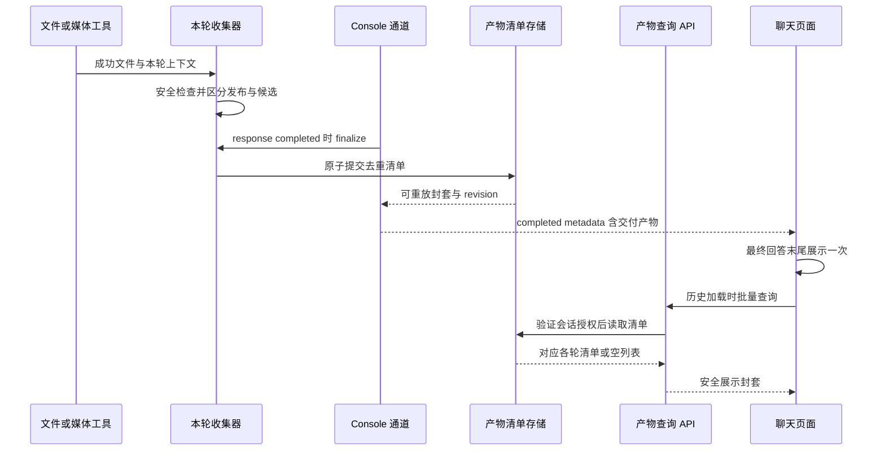
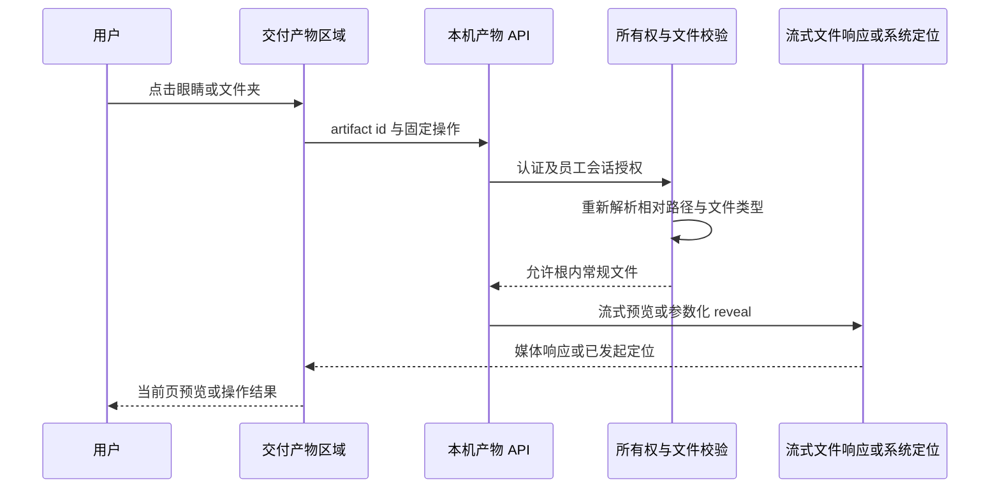

# GO CLAW v2.1.2 详细设计

日期：2026-09-03；定稿：2026-09-04
状态：前端布局与交互已获用户确认并完成代码接线；发布候选验收中，尚未验收的内容不得视为发布事实
适用基线：`codex/compute-recharge`；唯一可写仓库 `GresonKwan/GO-Claw-2.0`

配套：[实施计划](../plans/2026-09-03-go-claw-v2-1-2-implementation-plan.md)、
[目标接口与兼容合同](../../contracts/v2.1.2/README.zh-CN.md)、
[附件核查记录](../../incidents/2026-09-03-chat-attachments-utf8-investigation.zh.md)。
本文时序为 **v2.1.2 目标**；现行顺序仍以 [运行时序与维护规则](../../GO-CLAW-运行时序与维护规则.zh.md)
为准，须在对应代码落地时与可执行合同一起更新。

## 1. 版本目标

v2.1.2 纳入当前分支的线上算力充值系统，并新增三项能力：

1. Windows 便携版增量更新与 A/B 槽位切换；
2. “技能”一级页内的横向“浏览技能”入口；
3. 每轮任务完成后的“交付产物”区域，可安全打开文件或在资源管理器中定位。

附件 UTF-8 报告后续在 AT-03 复现为路径段未编码和二次 URL 解码，已按该 stage 单点修复；媒体
bytes 仍保持原样，不做 UTF-8 转码。自动矩阵已覆盖常见图片/MP4、特殊字符和 SSE 分块；真实视频
provider 理解和完整 UI 选取流程仍待验收。

本设计不向 QwenPaw 源项目提交任何代码、PR、Issue、Tag 或 Release。`qwenpaw` 命名空间仅作为
GO CLAW 当前代码兼容层保留。

## 2. 当前代码事实与设计约束

### 2.1 当前更新器

- 便携浏览器模式由 `src/qwenpaw/app/go_claw_updates.py` 编排；
- 当前协议下载完整 NSIS 更新 EXE；约 477 MB 是前次样本测量，不是未来资产固定大小；
- NSIS 停止应用后原地移动并替换根目录 `GO-CLAW-Portable.exe`、`binaries`、`LICENSE`、
  `README-PORTABLE.zh-CN.txt`；
- `installing.lock`、完整回滚和启动阻断已经存在，但 v2.0.1 → v2.1.1 完整包事故在事实基线中仍
  标记为未关闭；
- 当前 Header 已有可复用的橙点样式，但便携浏览器模式的更新状态只在 `UpdateSection` 内轮询；
  v2.1.2 将该样式迁移到设置齿轮和“检查更新”按钮，并由统一状态源驱动；
- 当前 F 盘程序文件的实测未压缩体积约 1.30 GiB：backend 约 1.05 GiB、Python runtime 约
  146 MiB、Node runtime 约 94 MiB。完整覆盖会重复下载大量未变化重型依赖。

### 2.2 当前技能页

`console/src/pages/Agent/Skills/index.tsx` 已通过 `?view=market` 和 `MarketPanel` 支持浏览技能，
HeaderActions 也有入口。v2.1.2 只新增一级页面内的可见 Banner，不新建第二套市场、不改变安装
合同。

### 2.3 当前对话渲染

`HostResponseCard` 已有 `contentAppend` 注入缝，适合在最终回答正文之后、消息操作栏之前呈现
交付产物。当前后端没有稳定的逐轮交付物合同，也没有受限的“打开/定位文件”本机 API，因此
不能只靠前端从自然语言中猜路径。

### 2.4 不可变条件

- 更新永不覆盖 `data`、`secrets`、`logs`、`cache`、`backups`、`updates`、
  `GO-CLAW-Config`、`portable.json`；
- 充值资料 `data/.go-claw-billing.json`、聊天、员工、技能、实例身份和凭据必须跨更新保留；
- 新版未通过产品就绪门禁时必须自动回到上一槽位；
- 更新检测失败不得影响聊天、员工、媒体工具、额度条或充值；
- 不自动安装；更新提示、下载和切换均保留明确的用户动作；
- 所有更新 manifest、组件包和更新引擎继续使用现有 GO CLAW updater 公钥链验签。

### 2.5 老用户无损更新与性能边界（2026-09-04 补充确认）

用户要求：**升级及失败回滚不能丢失已有聊天记录，不能减少或重置原有额度**。保护的是旧会话实际
可读和同一账户的余额，不只是“data 文件夹还在”或“额度接口返回 200”。

- A/B 只改变 `program_root`；`root/data`、`root/secrets` 和原 workspace 映射继续使用，员工 ID、
  chat/session 映射与历史附件引用保持兼容。既有数据需要迁移时只改必要文件，先备份该文件再原子写入；
  不全量备份聊天目录，不在回滚时用旧 data 快照覆盖用户新数据。
- 沿用原实例、凭据和 NewAPI 用户；新充值账户只绑定现有余额归属，不以新账本初始值、重新赠送额度
  或重新开户代替老余额。测试窗口内无业务交易则余额相等，有交易按真实增减核对，不要求百分比不变。
- 缺失/损坏身份或历史静态凭据盘不能被当作新盘重置；无法确认归属时保留原凭据和数据，只推迟新增
  充值初始化或身份恢复。原本已损坏的数据不假称已修好，不通过清空历史消除报错。
- 不新增启动全盘扫描、全聊天 hash、逐次联网对账或客户验收向导；轻量本地约束并入既有路径构造与
  初始化逻辑，正常额度请求和充值绑定流程照旧。内容/余额无损验证复用现有升级和回滚测试，不新增
  一套发布流水线。具体唯一合同见 [UP-C4 与 BILL](../../contracts/v2.1.2/README.zh-CN.md)。

## 3. 更新架构：组件增量 + A/B 槽位

### 3.1 选择的方案

v2.1.2 使用“组件级增量”，不在首版引入 `bsdiff` 一类二进制 patch：

- 每个程序文件只归属一个稳定组件；
- 组件摘要未变时不下载该组件；
- 组件摘要改变时下载该组件的完整压缩包；
- 未改变组件从当前活动槽位本地复制到目标槽位；
- 目标槽位完整校验后才切换；
- 后续可在不改变客户端状态机的前提下，把大组件继续拆分或升级为内容寻址分块。

这满足“只下载安装有变更的部分”，同时避免二进制 patch 对构建确定性、杀毒软件和断电恢复
造成额外风险。

### 3.2 组件边界

首版固定以下组件；CI 必须保证每个程序文件恰好属于一个组件：

| 组件 | 典型内容 | 变化特征 |
| --- | --- | --- |
| `desktop-shell` | 根启动壳、WebView/Tauri 必需资源 | 低频 |
| `backend-core` | backend EXE、`_internal/qwenpaw`、console 静态资源 | 高频 |
| `backend-heavy-runtime` | torch、onnxruntime、transformers、playwright 等 | 低频、大体积 |
| `python-runtime` | `binaries/python-runtime` | 低频 |
| `node-runtime` | `binaries/node-runtime` | 低频 |
| `bundled-plugins` | 内置媒体插件和产品插件 | 中频 |
| `product-docs` | LICENSE、便携说明 | 低频 |

构建时若文件无法归类、重复归类或组件边界发生无意漂移，CI 直接失败。

### 3.3 便携目录

v2.1.2 桥接完成后的程序目录为：

```text
<root>/
  GO-CLAW-Portable.exe          # 稳定启动壳
  portable.json
  runtime/
    active-slot.json            # 原子写入；active/lastKnownGood/generation
    slots/
      A/
        release-manifest.json
        binaries/
      B/
        release-manifest.json
        binaries/
  updates/
    installing.lock
    transactions/<transaction-id>/transaction.json
    packages/<sha256>.zip
    install.log
    last-update-error.txt
  data/ secrets/ logs/ cache/ backups/ GO-CLAW-Config/
```

活动槽位程序文件不由更新器改写；目标槽位只在 staging 状态写入。不可把 mutable 目录搬进槽位。
所有运行期插件安装、技能和缓存仍写产品根的可变数据区；组件内的 bundled-plugins 只是只读种子。
NTFS 可具备 ACL，exFAT 不具备同等权限保证；两者均不得依赖硬链接或跨卷 rename 完成切槽。

`active-slot.json` 最小合同：

```json
{
  "schemaVersion": 1,
  "active": "A",
  "lastKnownGood": "A",
  "generation": 7,
  "activeVersion": "2.1.2",
  "activeManifestSha256": "<64-hex>",
  "lastKnownGoodManifestSha256": "<64-hex>"
}
```

写入顺序固定为临时文件 → flush → 原子替换。启动壳拒绝未知 schema、缺失槽位和 manifest
摘要不一致。

根目录启动壳不受槽位原子切换保护，必须另行事务化：下载期只暂存；安装期等待壳退出、备份旧壳、
校验并替换新壳。事务记录 old/new shell 摘要，失败同时恢复壳及活动槽位。完整回滚确认前不得清理
旧壳或 lastKnownGood。更新引擎运行在独立事务目录，不能位于正在替换的槽位。

### 3.4 v2.1.1/v2.0.1 桥接

旧客户端只认识 `latest.json` 中的单一 setup EXE，因此 v2.1.2 Release 同时提供一个由现有
公钥签名的轻量 Bridge EXE：

1. 旧客户端照常下载并二次验签 Bridge；
2. Bridge 自带独立 `go-claw-update-engine.exe`，不依赖即将停止的 Python/backend；
3. Engine 获取并验签 v2 release index，并核对 Bridge 内嵌的目标版本/manifest 摘要；
4. 把当前 legacy 根视为只读来源，规划目标槽位；
5. 仅下载摘要不匹配的组件；
6. 完整校验目标槽位；
7. 停止旧应用，安装稳定启动壳并切到目标槽位；
8. 新版就绪失败时恢复旧启动壳和 legacy 路径。

兼容事实：`console/src-tauri/src/updates.rs` 的旧 Tauri 安装链会先 `stop_and_wait` 后启动安装器，
不能假设旧 Web UI 在 Bridge 下载组件时仍在线。Bridge 必须自带轻量单进度条窗口，在旧壳退出后
继续显示下载/安装进度；不增加复杂状态卡。新客户端在后端退出前移交已持久化的进度，重启后续读
同一 transaction。Bridge 只在用户点击旧版“安装”后运行，该动作授权本次桥接交易；旧包自身 UI
不能靠远程 manifest 变成新版 UI。新客户端严格分开“下载”和“确认安装”。

若旧盘经过热修复导致某组件摘要不再等于官方 v2.1.1，规划器不得猜测；它下载该组件的
v2.1.2 正式包，最终仍以目标全量 manifest 校验为准。

### 3.5 发布合同

保留旧 `latest.json` 供 v2.0.1/v2.1.1 使用，同时新增 `release-index-v2.json`。下列 URL 仅是目标布局
示例，并非已部署 endpoint；index 的原始字节也必须有 detached signature，内置公钥验签后才解析：

```json
{
  "schemaVersion": 2,
  "version": "2.1.2",
  "channel": "stable",
  "minUpdaterVersion": "2.1.2",
  "releaseManifest": {
    "url": "https://goclaw.host:8443/updates/releases/2.1.2/windows-x64.json",
    "sha256": "<hex>",
    "signature": "<minisign>"
  },
  "legacyBridge": {
    "url": "https://goclaw.host:8443/updates/GO-CLAW-Update-2.1.2-bridge.exe",
    "sha256": "<hex>",
    "signature": "<minisign>"
  }
}
```

目标 `windows-x64.json` 包含：

- 目标版本与构建提交；
- 每个文件的相对路径、size、SHA-256、component；
- 每个组件包的 URL、压缩后 size、SHA-256、minisign signature；
- 删除清单；
- 最低磁盘空间、最长相对路径、受限启动入口标识（不是任意命令行）；
- product-readiness 合同版本。

客户端只信任签名 release manifest 中列出的 HTTPS URL。任何重定向后的最终 host、长度、摘要或
签名不符合合同时失败关闭。
组件 ID、mount 及签名边界详见配套合同；删除清单只能作用于非活动目标程序树，不能删除用户数据。

### 3.6 状态机

```text
IDLE
  -> CHECKING
  -> AVAILABLE
  -> PLANNING
  -> DOWNLOADING
  -> STAGED
  -> SWITCH_PENDING
  -> VERIFYING
  -> COMMITTED

切换前失败 -> FAILED（旧版本继续可用，可重试；不伪称已回滚）
安装开始后失败 -> ROLLING_BACK -> ROLLED_BACK
回滚不完整 -> BLOCKED（保留 installing.lock）
```

`transaction.json` 每次只前进一个状态并记录：targetVersion、fromVersion、sourceSlot、targetSlot、
已下载组件摘要、最后完成阶段、回滚结果。不得记录 token、支付资料、客户文件名或聊天内容。
并发交易、revision、超时、进度映射与恢复日志规则以配套合同为准。

### 3.7 成功时序（UP-01 下载，UP-02 安装）





### 3.8 失败与恢复（UP-03）



断电恢复规则：

| 断电点 | 下次启动动作 |
| --- | --- |
| 下载/构建 SlotB | 继续或重建 SlotB；仍启动 SlotA |
| SlotB 校验完成但未切换 | 仍启动 SlotA，允许继续切换 |
| 已切换但未标记 good | 对 SlotB 执行有界就绪检查；失败即回 A |
| 回滚中断 | 保留 lock，启动壳只允许继续恢复，不启动混合版本 |

普通双击入口始终拒绝安装锁，不能只凭环境变量或 transaction id 绕过。锁存在时仅由受信更新引擎
使用与本地交易绑定的受控恢复通道启动健康探针；重启后引擎先持有该产品互斥锁、核验日志及程序
摘要，再恢复未完成交易。此行为变更必须同批更新现行运行时序和维护合同测试，不能提前放松锁。

A/B 只回滚程序，不回滚聊天或账本。v2.1.2 数据迁移必须向后兼容实际来源版本（包括 Bridge 来源
v2.0.1），不是只兼容相邻版本；采用新增可选字段、
幂等迁移；不可逆迁移不进入本版。新旧后端不得并发写同一 data。运行中任务未结束时提示用户确认
等待或取消，不能在下载完成时自动终止任务。

### 3.9 产品就绪门禁

切槽成功至少同时满足：

1. `/api/version` 等于目标版本；
2. backend/Python/Node 的程序路径位于目标槽位，数据与凭据仍指向原产品根；稳定壳及独立更新引擎
   不以此项误判。路径断言复用既有启动构造，不另扫数据目录；
3. 干净交付样本五个预置员工就绪；存量盘按升级前的启用状态验收，不重启用户主动停用的员工；
4. `qwen-image-tool`、`wan27-tool` 均 loaded/enabled；
5. 干净样本的内容生产员工暴露五个媒体工具；存量盘保留用户禁用选择，验证应启用工具无回退；
6. 新盘和原本已正常开通的旧盘，`/api/console/quota` 返回有效额度三字段；已知旧盘原就缺少实例
   标识的情况单独记录为既有充值/额度读取问题，不为通过门禁重建身份或赠额，不据此误判程序切换失败；
7. 有 billing profile 时，充值 config/balance 可读；充值暂时不可用只标记 degraded，不阻断聊天
   和槽位提交。

同一网络故障不能被误记为本地插件/员工失败；记录 network 与 local readiness 的独立 stage。
正常交付仍保留有效 quota 门禁，不以伪造额度或 `/api/version` 成功代替验收。上述存量异常分类是
v2.1.2 目标细化，落地时须与运行合同/测试同改；不能把升级新引入的额度不可读归为“原有问题”。
本节是运行就绪条件，不把新增的历史全量比对、远端账户审计塞入启动。老用户无损断言只并入计划
§9.2 的既有样本测试；已有额度超时预算不扩大，也不因暂时查不到余额触发开户或余额写入。

## 4. 更新提示前端

### 4.1 统一状态源

新增统一 `UpdateContext`：

- Tauri 安装版适配现有 `DesktopUpdateContext`；
- Windows 便携浏览器模式适配 `/api/updates/status`；
- 设置齿轮与设置弹出面板只消费统一状态，不各自重复检查；
- 页面启动、窗口重新聚焦和网络恢复时刷新；后端 6 小时检查仍是权威定时器；
- 可增加 `/api/updates/events` SSE 推送状态，SSE 断开时回退 10 秒轮询。

### 4.2 弹出组件、橙点与单进度条

- 继续复用既有“点击设置齿轮后弹出设置组件”的交互，不新增全屏更新页，也不让版本号承担入口；
- `AVAILABLE`、`PLANNING`、`DOWNLOADING`、`STAGED`：设置齿轮右上角和“检查更新”按钮右上角
  同时显示 6px 小橙点；版本号旁不显示橙点；
- 下载完成、等待用户开始安装时橙点继续保留；用户确认安装且安装流程实际开始后，两处橙点同时消失；
- `SWITCH_PENDING` 是引擎持久化安装锁后的实际安装开始；按钮点击本身不算开始。刷新页面不清除提示；
  安装开始后的失败/回滚不自动复亮，同一版本只有重新检查确认可重试后才重新提示；
- `IDLE`/无更新：两处均不显示橙点；`FAILED` 不增加第三种复杂图标，仅在弹出组件内用简短错误文案和
  重试按钮表达；
- 整个更新流程只使用一条进度条：下载阶段映射为 0–90%，下载完成等待安装时保持 90%，安装开始后
  在同一进度条上继续 90–100%；
- 不显示分步卡片、进度环或多套状态指示；提示不阻挡聊天，不自动打开弹出组件，不自动下载安装。

用户点击设置齿轮进入既有设置弹出组件，在“版本与更新”区域点击“检查更新”。组件内只保留目标版本、
更新说明、需下载体积、单进度条和当前可执行按钮，避免重复解释 A/B 或组件拆分细节。

## 5. 技能页 Banner

### 5.1 布局

Banner 位于 `PageHeader` 下、搜索与筛选工具栏上：

- 左侧：魔杖/技能图标、一级标题“从技能中获得专业能力”、二级标题“从11万个技能中，找到效率最优解”；
- 右侧靠边：主按钮“浏览技能”；
- 点击按钮继续复用 `?view=market` 与 `MarketPanel`；
- 移动端纵向堆叠，按钮保持至少 44px 触控高度；
- 现有 HeaderActions 入口保留，避免改变熟悉路径。

### 5.2 可访问性

Banner 使用语义化 section，按钮有明确 accessible name；浅色/深色主题均沿用 GO CLAW 橙色
强调，不使用纯色大面积填充。

## 6. 单轮“交付产物”

### 6.1 展示合同

只有本轮存在可交付文件时才显示区域。区域位于本轮最终回答正文之后、复制/时间操作之前。

交付区按媒体与普通文件分组：

- `image`、`video` 使用单行横向媒体轨道，卡片按生成顺序排列，支持触控拖动、触控板横向滚动、
  `Shift + 鼠标滚轮` 和键盘浏览，不因媒体数量增加而纵向撑长对话；
- 原生横向滚动条始终隐藏，另用绝对定位的覆盖层滚动指示条；指示条默认透明，鼠标悬浮轨道或轨道
  正在滚动或键盘聚焦时显示，停止滚动 800ms 且鼠标移出、焦点离开后自动隐藏；指示条不进入文档流、不改变上下占位，
  显隐只改变 opacity，滑块仍可拖动；滚轮、触控、键盘和辅助技术滚动不受影响；
- 每张媒体卡显示缩略图/视频封面和精简文件名；桌面端鼠标悬浮或键盘聚焦时封面变暗，中央出现
  `预览`（眼睛）与 `在文件夹中显示`（文件夹）两个图标按钮；
- 触屏设备没有 hover，两个操作按钮常驻在卡片右下角，保证功能不依赖悬浮；
- 点击图片预览在当前聊天页面打开 Lightbox，不跳转新页面、不调用系统图片应用；点击视频预览在
  同一页面打开带原生控制条的播放器；预览打开时背景设为 inert 并锁定焦点，支持 `Esc`/关闭按钮，
  关闭后焦点回到原媒体卡；
- 其他类型继续使用紧凑文件列表，每行展示文件图标、名称、类型/大小，以及靠右的一个拆分下拉按钮。

普通文件列表操作：

- 主按钮 `打开`：仅允许安全文档、音频、压缩包和文本类型；图片/视频统一进入媒体轨道预览；
- 右侧下拉箭头展开菜单，菜单项 `在文件夹中显示` 使用 Windows Explorer `/select,`；
- 文件不存在或已移动时显示状态，按钮不可执行；
- 可执行文件、脚本、快捷方式禁用主按钮 `打开`，下拉菜单仍只允许安全定位。

普通文件列表多于 3 项默认折叠；媒体轨道不折叠，但只渲染可视窗口及相邻卡片。同一路径在一轮内
去重。历史对话重新打开时仍能显示对应产物。

### 6.2 后端 DTO

前端永远不接收绝对路径：

```ts
interface DeliverableItem {
  id: string;
  turnId: string;
  name: string;
  kind: "document" | "image" | "video" | "audio" | "archive" | "code" | "other";
  mimeType: string;
  sizeBytes: number;
  exists: boolean;
  directOpenAllowed: boolean;
  previewAllowed: boolean;
  previewKind: "image" | "video" | null;
  createdAt: string;
}
```

完整列表封套含 `schemaVersion/agentId/chatId/turnId/responseId/revision/items`，以及批量历史查询与
错误码，见 [目标接口合同](../../contracts/v2.1.2/README.zh-CN.md)。本 DTO 是目标增量字段，旧客户端
可忽略；不得改变现有 `response.output` 或工具原有消息结构。

打开接口：

```http
POST /api/console/deliverables/{artifact_id}/open
Content-Type: application/json

{"action":"open"}
```

`action` 只允许 `open` 或 `reveal`。服务端用 artifact id 查询经所有权校验的本地清单，再重新
解析和校验路径；客户端不能提交 path。

媒体内容接口：

```http
GET /api/console/deliverables/{artifact_id}/thumbnail
GET /api/console/deliverables/{artifact_id}/content
```

两个接口都只接受 artifact id。`thumbnail` 返回限制尺寸和像素数量的缓存缩略图；`content` 仅允许
已识别的图片/视频 MIME，图片流式返回，视频支持单区间 `Range`，以便当前页面播放器拖动。响应固定
`Content-Disposition: inline`、`X-Content-Type-Options: nosniff`，不得把本机绝对路径暴露给浏览器。

### 6.3 产物识别

采用“显式发布为主，自动归集为辅”，避免把临时文件、缓存或内部源码误列为交付：

1. `send_file_to_user` 成功返回的文件必定登记；
2. 图片/视频工具成功返回的本地 DataBlock/URLSource 经安全检查后登记；远端 URL 不伪装成本机文件，
   保存失败维持原工具消息并标记不可本地交付；
3. `write_file`/`edit_file`/`append_file` 只登记候选；候选必须在最终回答中被引用或由
   `send_file_to_user` 发布后才进入交付区；
4. shell 生成文件必须由 agent 调用 `send_file_to_user` 或新增的内部 publish helper；
5. 最终响应完成时把去重后的安全元数据写入本地 turn manifest，并在 response metadata 中只写
   artifact id 与展示字段；
6. 取消、失败和超时轮次不显示未确认候选。

### 6.4 安全边界

- 只允许当前员工 workspace、media/output 根目录中的常规文件；
- `resolve()` 后必须仍位于允许根；拒绝 symlink/junction 穿越；
- 始终复用现有敏感文件守卫；凭据、密钥和内部账本不能因位于 workspace 或被工具返回就变成交付物；
- 产物必须是存在的常规文件，不登记目录；`reveal` 打开文件所在目录并选中文件；
- 拒绝 `.exe/.com/.scr/.bat/.cmd/.ps1/.vbs/.js/.jse/.wsf/.lnk/.url/.msi` 的直接打开；
- 后端使用参数数组调用 Explorer/系统 opener，不经过 shell；
- 预览接口必须重新执行 owner、chat、允许根、symlink/junction、文件存在性和 MIME magic 校验；
- 缩略图解码设置文件大小、像素数、帧数和耗时上限，缓存位于可清理的 `cache/deliverables`，不得进入
  更新槽位或账本备份；视频只允许单 Range，拒绝多区间和超范围请求；
- manifest 原子写入 `data/deliverables/<agent>/<chat>/<turn>.json`，只保存允许根类别和相对路径，以适应
  U 盘盘符变更。POSIX 使用 `0600`；Windows 在支持 ACL 的文件系统继承产品数据目录权限，exFAT
  不宣称有 owner-only 隔离。接口仍强制认证/当前员工/会话校验，不写日志中的绝对路径；
- 删除聊天时同步删除映射；产品文件本身不自动删除。

### 6.5 登记与历史时序（DL-01）



### 6.6 预览与定位时序（DL-02）



路径、权限或格式校验失败时停在 Guard，返回脱敏结构化错误；不调用系统打开，也不回退任意路径。

## 7. 算力充值纳入 v2.1.2

v2.1.2 Release 必须包含 `codex/compute-recharge` 的充值代码，并复核以下行为。历史对话中已报告
￥1 支付成功，但本轮没有重查支付后台；现行基线仍含“默认关闭”记录，Phase 0 必须以带日期的
客户端/服务端证据消除差异，不能从本文反推生产已经开启：

- 微信 Native ￥1 订单支付成功；
- Billing 账本只有一条 PAYMENT 与一条 QUOTA_CREDIT；
- NewAPI 精确增加 5,000,000 展示算力对应额度，无重复入账；
- 客户端额度与充值账本自动刷新；
- 金额输入为整数元；
- 客户页面不展示单日限额/退款/发票灰色说明；服务端单日 ￥100,000 限额继续执行；
- 更新、回滚和 A/B 切槽均保留 `.go-claw-billing.json` 与原 account 绑定。

充值服务故障不得阻止槽位切换；但正式 v2.1.2 staging 必须另做一次 ￥1 支付、到账、重启、切槽、
回滚后的账本一致性验证。
原余额保留检查复用这次对账和升级测试，不要求每种旧盘/每次回滚重新支付 ￥1。旧用户历史赠送及
充值形成的余额仍以原 NewAPI 用户为准，不从本版新账本的记录总和重建或覆盖。

## 8. 非目标

- 不在 v2.1.2 做 macOS A/B 更新；
- 不做后台静默安装；
- 不做二进制级 bsdiff；
- 不把客户数据复制进 A/B 槽位；
- 不让浏览器提交任意本机路径；
- 不改变技能市场后端或安装合同；
- 不向 QwenPaw 上游提交任何修改。

## 9. 已确认冻结的视觉方案

按用户本轮之前的逐项确认固定，不再次要求同一布局确认：

- 设置齿轮与“检查更新”按钮右上角各显示 6px 橙点，版本号无橙点；橙点在安装实际开始时消失；
- 既有设置弹出组件内只用一条连续进度条表达下载和安装；
- 技能页 76–88px 的柔和橙色横向 Banner；
- Banner 文案固定为“从技能中获得专业能力 / 从11万个技能中，找到效率最优解”，按钮靠右；
- 交付产物使用紧凑列表，单文件显示一行，多文件默认显示三行；
- 每行右侧只有一个 `打开` 拆分下拉按钮，`在文件夹中显示` 收入下拉菜单；危险扩展名禁用主操作。
- 图片和视频位于可横向滑动的媒体轨道；悬浮/聚焦时变暗并出现眼睛、文件夹按钮，图片在当前页面
  Lightbox 预览，视频在当前页面播放器预览。
- 横向滚动指示条默认隐藏，hover/focus/滚动时显示，采用覆盖层；显隐不能改变轨道及后续内容位置。

视觉确认只冻结布局和交互优先级；具体间距、颜色和暗色模式仍以现有 design token 实现。

## 10. 附件 UTF-8 核查的版本归属

2026-09-03 的当前 F 盘 PNG 取证未复现 UTF-8 异常，不能据此宣称所有图片/视频均无缺陷。
本版必须补齐 UI 选取、真实媒体文件、多员工、历史重放、SSE 分块、错误路径的回归；具体矩阵见
[核查记录](../../incidents/2026-09-03-chat-attachments-utf8-investigation.zh.md)。
没有复现时直接继续功能实施，不以 `errors=ignore`、重试多个编码或强转字符串作为“修复”。
出现证据后按 upload → preview → normalize → formatter → provider → SSE 的首错顺序单点修复，
附相同样本修复前后结果，再把该项从核查转为已修复缺陷。
